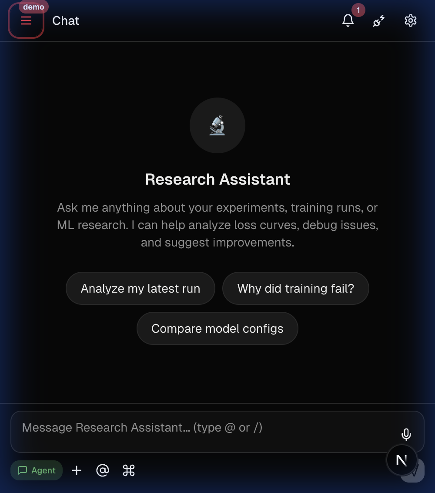
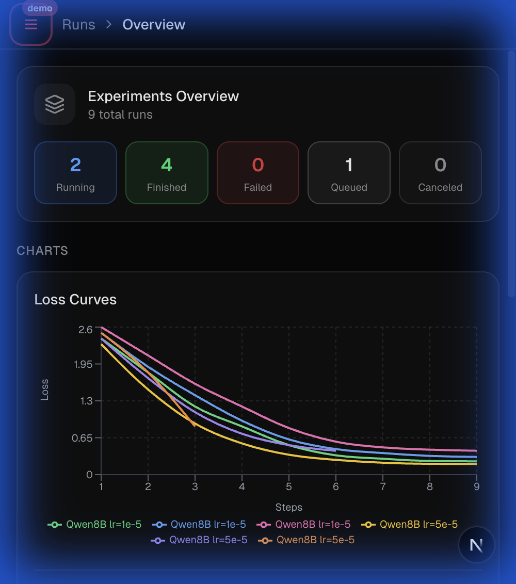
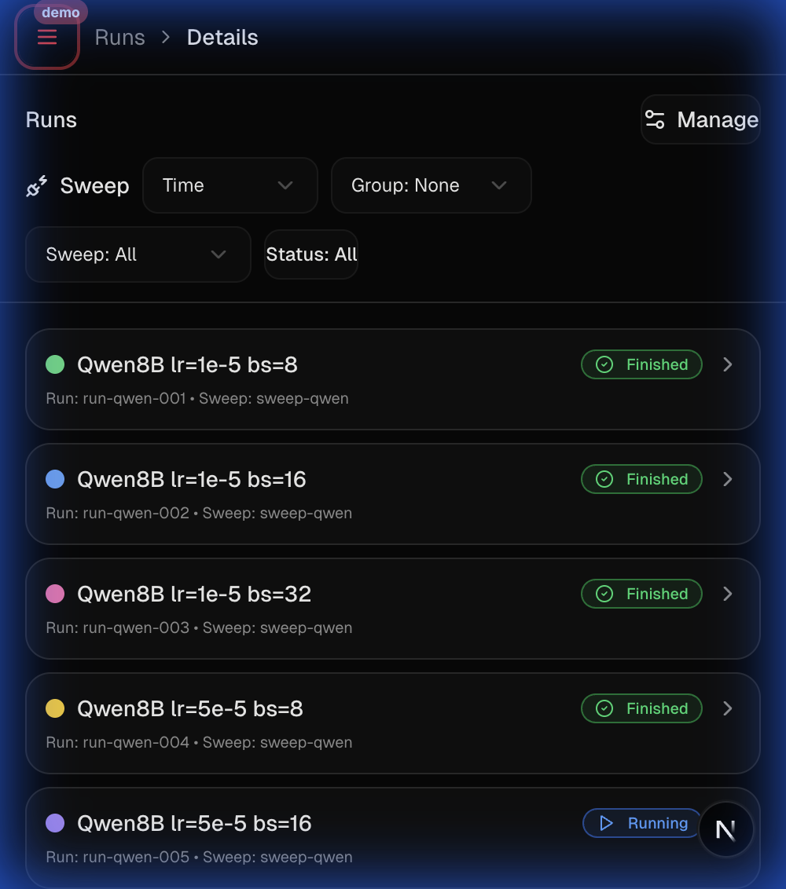
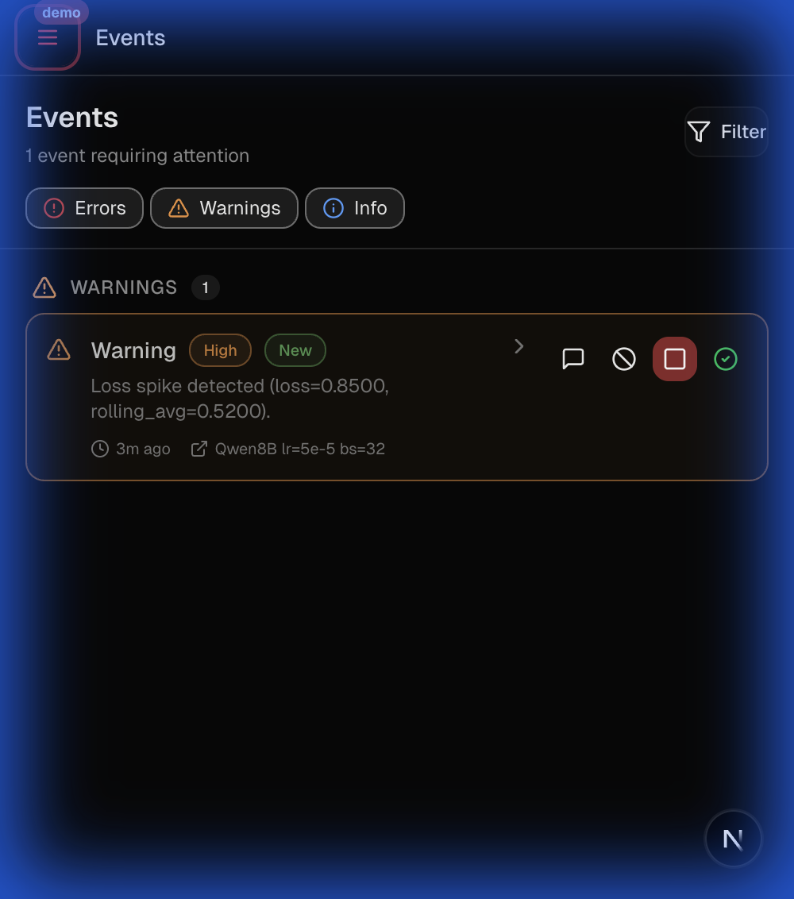
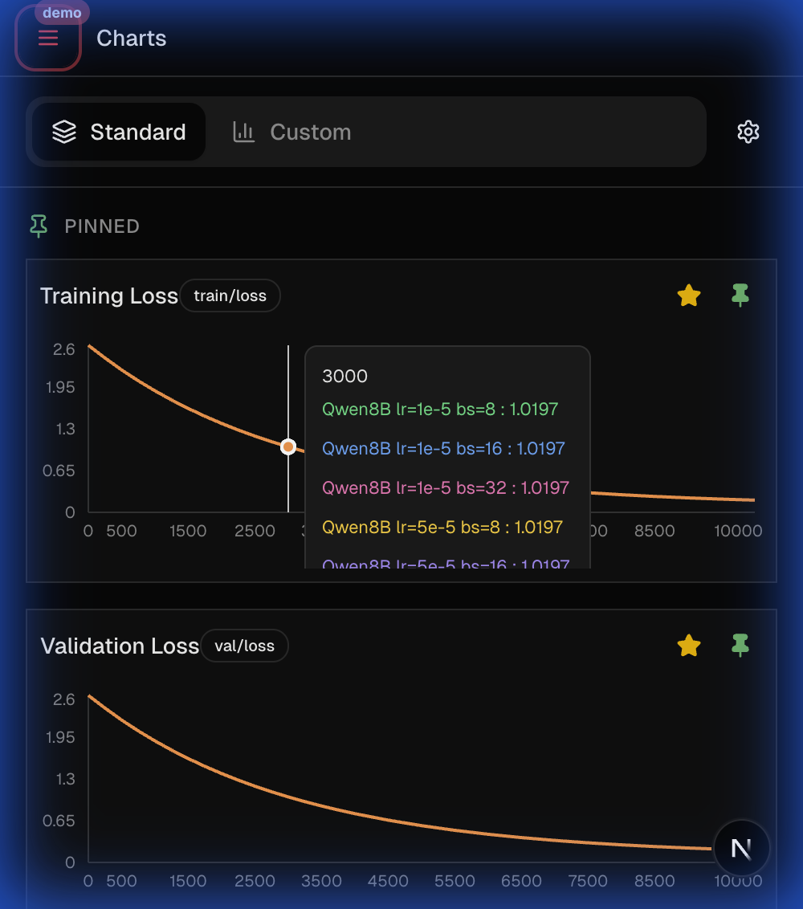
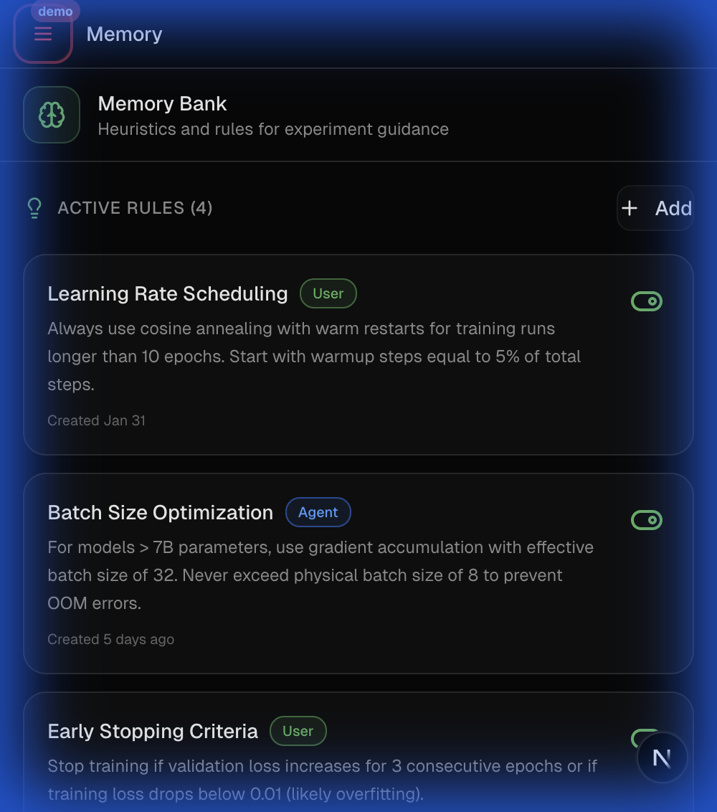
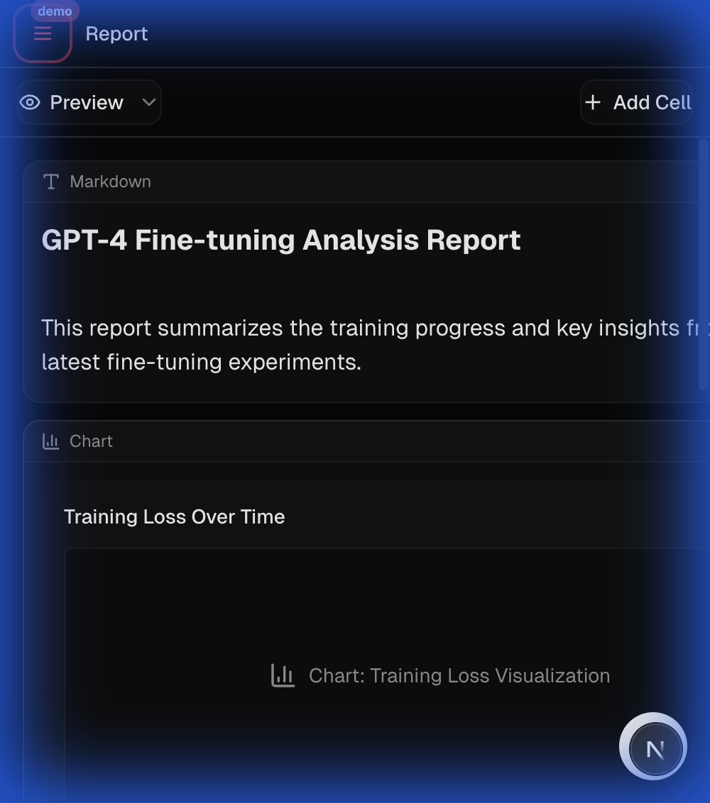

# Research Agent

A research assistant for ML researcher on mobile and web view.

**Live Demo**: [https://km71ympfr5y29n-3000.proxy.runpod.net/](https://km71ympfr5y29n-3000.proxy.runpod.net/)


---

## What Is This?

Research Agent is a **mobile-first web dashboard** that wraps an LLM-powered coding agent (OpenCode) with a purpose-built UI for ML experiment workflows. Instead of switching between terminals, WandB, and chat windows, everything lives in one interface:

- **Chat** with an AI assistant that has full context on your experiments
- **Launch and monitor** training runs directly from the UI
- **Wild Mode** — an autonomous loop where the agent explores, runs sweeps, handles alerts, and iterates until a research goal is met

---

## Demo Tour

### Chat — Research Assistant

The landing view. Ask questions, analyze runs, or kick off Wild Mode for autonomous research.



### Runs — Overview

High-level dashboard showing experiment status counts and live loss curves across runs.



### Runs — Details

Granular view of individual runs with IDs, sweep associations, status badges, and filtering.



### Events — Alerts

Real-time alert feed from job sidecars. Alerts include NaN detection, loss spikes, and LLM-judged anomalies. Each alert has actionable buttons (Chat to investigate, Stop to kill).



### Charts — Metric Visualization

Pinned metric charts with hover tooltips for cross-run comparison at specific steps.



### Memory — Heuristic Rules

Persistent rules that guide the AI assistant's analysis (e.g., "use cosine annealing for LR scheduling"). Toggleable per-project.



### Report — Notebook-Style Analysis

Markdown + chart cells for documenting findings. Combines narrative analysis with embedded visualizations.



---

## Architecture

```
Frontend (Next.js :3000)
    │  HTTP + NDJSON stream
    ▼
Backend (FastAPI :10000)
    │  REST + SSE
    ▼
OpenCode (:4096)
    │  Anthropic SDK
    ▼
Modal LLM Gateway ──▶ Anthropic API
    │
    └──▶ Log Queue ──▶ SQLite (Modal Volume)
```

The system has four layers:

| Layer           | Tech                                        | Purpose                                                              |
| --------------- | ------------------------------------------- | -------------------------------------------------------------------- |
| **Frontend**    | Next.js 16, React 19, Tailwind 4, shadcn/ui | Mobile-first dashboard UI                                            |
| **Backend**     | FastAPI (Python)                            | Chat routing, job orchestration, alert management                    |
| **OpenCode**    | OpenCode server (Node.js)                   | LLM session management, tool use, SSE streaming                      |
| **LLM Gateway** | Modal (Python)                              | Auth-swapping proxy to Anthropic/DeepInfra APIs with request logging |

Jobs run in **tmux** with a sidecar process that monitors metrics, detects anomalies (NaN, loss spikes), and posts alerts back to the server.

For the full architecture diagram with Mermaid, see [architecture.md](architecture.md).

---

## Key Concepts

### Wild Mode (Autonomous Loop)

Wild Mode is a **frontend-driven** autonomous research loop. The agent cycles through three stages:

1. **Exploring** — Agent reads the codebase and outputs a `<sweep>` tag to define experiments
2. **Running** — Frontend polls for alerts and run completions; agent handles events one at a time
3. **Analyzing** — Agent evaluates results and signals `CONTINUE`, `COMPLETE`, or `NEEDS_HUMAN`

The agent communicates via XML tags (`<sweep>`, `<resolve_alert>`, `<promise>`) in its response text. The frontend parses these and calls the appropriate API endpoints. See [wild_loop_state_machine.md](wild_loop_state_machine.md) for full details.

### Job Sidecar

Each training run gets a tmux window with a **sidecar process** (`job_sidecar.py`) that:

- Monitors the job pane for exit
- Reads `metrics.jsonl` for loss tracking
- Fires rule-based alerts (NaN, 3× loss spike)
- Runs an LLM judge every 30s for anomaly detection
- Reports status changes (`launching → running → finished/failed`) back to the server

### Streaming Protocol

Chat uses **NDJSON** (newline-delimited JSON) streaming:

| Event            | Description                      |
| ---------------- | -------------------------------- |
| `part_delta`     | Text or reasoning content chunk  |
| `part_update`    | Tool call status update          |
| `session_status` | Session idle (response complete) |
| `error`          | Error message                    |

### External Integrations

- **Slack** — Webhook notifications for alerts and run events
- **Telegram** — Bot API for remote monitoring and commands

---

## Tech Stack

| Category        | Technology                            |
| --------------- | ------------------------------------- |
| Framework       | Next.js 16 (App Router)               |
| React           | React 19                              |
| Styling         | Tailwind CSS 4.x (OKLCH color system) |
| UI Components   | shadcn/ui (Radix primitives)          |
| Charts          | Recharts                              |
| Backend         | FastAPI (Python 3.10+)                |
| LLM Integration | OpenCode → Modal Gateway → Anthropic  |
| Job Execution   | tmux + libtmux                        |
| Package Manager | pnpm                                  |

---

## Project Structure

```
├── app/                          # Next.js App Router
│   ├── globals.css               # Global styles & OKLCH color vars
│   ├── layout.tsx                # Root layout
│   └── page.tsx                  # Main entry — single state instance
├── components/                   # React components
│   ├── ui/                       # ~57 shadcn/ui base components
│   ├── connected-chat-view.tsx   # Chat with streaming + Wild Mode
│   ├── wild-loop-banner.tsx      # Wild loop status display
│   ├── runs-view.tsx             # Run management views
│   ├── events-view.tsx           # Alert feed
│   └── ...                       # ~29 feature components
├── hooks/                        # Custom React hooks
│   ├── use-chat-session.ts       # Streaming, 60s timeout, message queue
│   ├── use-wild-loop.ts          # Autonomous loop state machine
│   ├── use-runs.ts               # Run/sweep CRUD + polling
│   └── use-alerts.ts             # Alert polling + responses
├── lib/                          # Utilities
│   ├── api.ts                    # NDJSON parsing, StreamEvent types
│   ├── types.ts                  # All TypeScript type definitions
│   └── utils.ts                  # cn() helper
├── server/                       # Backend
│   ├── server.py                 # FastAPI server (1700+ lines)
│   ├── job_sidecar.py            # Tmux job monitor
│   ├── opencode.json             # LLM provider config
│   └── requirements.txt          # Python deps
└── .dev/                         # Internal docs (you are here)
```

---

## Getting Started

### Prerequisites

- **Node.js 18+** and **pnpm**
- **Python 3.10+**
- **tmux**
- **OpenCode CLI** (`npm install -g opencode`)

### Quick Start

```bash
# 1. Set your gateway token
export RESEARCH_AGENT_KEY="your-gateway-token"

# 2. Start tmux session (for job execution)
tmux new-session -s research-agent -d

# 3. Start OpenCode (in the project workdir)
cd /path/to/your/research/project
OPENCODE_CONFIG=/path/to/server/opencode.json opencode serve

# 4. Start the backend server (separate terminal)
cd server/
pip install -r requirements.txt
python server.py --workdir /path/to/your/research/project

# 5. Start the frontend (separate terminal)
pnpm install
pnpm dev
```

The frontend runs on `:3000`, the backend on `:10000`, and OpenCode on `:4096`.

### Optional Environment Variables

| Variable                         | Default                    | Purpose                                  |
| -------------------------------- | -------------------------- | ---------------------------------------- |
| `RESEARCH_AGENT_KEY`             | —                          | Gateway API token (required)             |
| `OPENCODE_URL`                   | `http://localhost:4096`    | OpenCode server URL                      |
| `OPENCODE_PASSWORD`              | —                          | HTTP Basic Auth for OpenCode             |
| `RESEARCH_AGENT_USER_AUTH_TOKEN` | —                          | Optional auth token for all API requests |
| `MODEL_PROVIDER`                 | `research-agent`           | LLM provider ID from `opencode.json`     |
| `MODEL_ID`                       | `claude-sonnet-4-20250514` | Model to use                             |

---

## Further Reading

| Document                                                 | Description                             |
| -------------------------------------------------------- | --------------------------------------- |
| [architecture.md](architecture.md)                       | Full Mermaid architecture diagrams      |
| [wild_loop_state_machine.md](wild_loop_state_machine.md) | Complete Wild Mode state machine spec   |
| [server/README.md](../server/README.md)                  | Backend API reference & troubleshooting |
| [CLAUDE.md](../CLAUDE.md)                                | AI assistant coding guidelines          |
