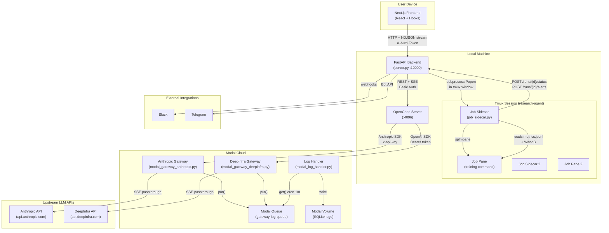
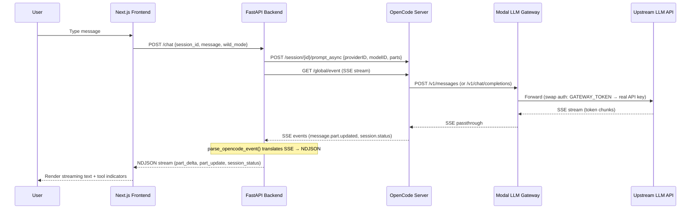
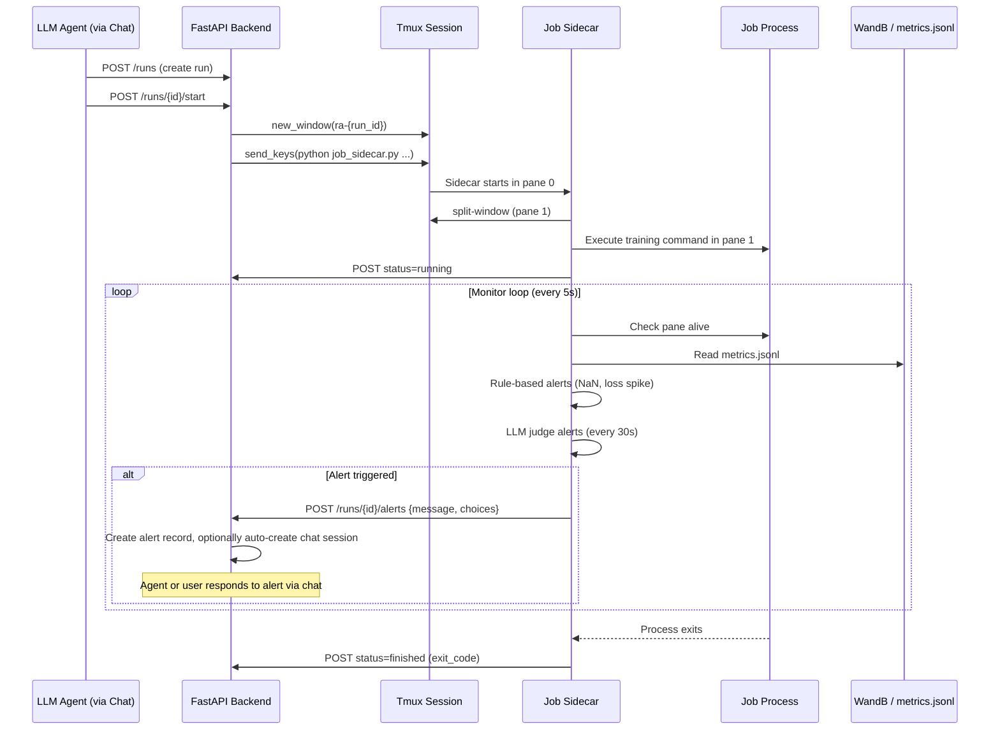

# Architecture: FE ↔ BE ↔ OpenCode ↔ LLM Gateway

## System Topology

## Chat & Streaming Flow

## Job Execution & Monitoring Flow

## Component Reference

### Frontend (`v0-research-agent-mobile/`)

| Layer       | File                        | Role                                            |
| ----------- | --------------------------- | ----------------------------------------------- |
| App Shell   | `app/page.tsx`              | Single hook instance, shared state              |
| Chat Hook   | `hooks/use-chat-session.ts` | Streaming state, 60s timeout, message queue     |
| Wild Loop   | `hooks/use-wild-loop.ts`    | Frontend-driven autonomous loop (v3 Ralph Loop) |
| Runs Hook   | `hooks/use-runs.ts`         | Run/sweep CRUD + polling                        |
| Alerts Hook | `hooks/use-alerts.ts`       | Alert polling + responses                       |
| API Client  | `lib/api.ts`                | NDJSON parsing, `StreamEvent` types             |

### Backend (`server/server.py`)

| Area         | Endpoints                                             | Description                                    |
| ------------ | ----------------------------------------------------- | ---------------------------------------------- |
| Chat         | `POST /chat`, `GET/POST /sessions`                    | NDJSON streaming from OpenCode, session CRUD   |
| Runs         | `POST /runs`, `POST /runs/{id}/start`, `GET /runs`    | Job creation, tmux launch, status tracking     |
| Sweeps       | `POST /sweeps`, `POST /sweeps/{id}/start`             | Hyperparameter sweep orchestration             |
| Alerts       | `POST /runs/{id}/alerts`, `POST /alerts/{id}/respond` | Sidecar-triggered alerts, user/agent responses |
| Wild Mode    | `GET/POST /wild/status`, `POST /wild/configure`       | Autonomous loop state management               |
| Integrations | Slack webhooks, Telegram Bot API                      | External notifications                         |

**Active config**: `MODEL_PROVIDER=research-agent`, `MODEL_ID=claude-sonnet-4-20250514`

### Tmux Job Execution (`server/job_sidecar.py`)

| Component             | Role                                                               |
| --------------------- | ------------------------------------------------------------------ |
| **Sidecar process**   | Spawned by server in tmux window pane 0                            |
| **Job pane**          | Split pane 1 where the actual command runs                         |
| **Status callbacks**  | Reports `launching → running → finished/failed` to server          |
| **Rule-based alerts** | Detects NaN loss, loss spikes (>3× previous), via `metrics.jsonl`  |
| **LLM judge alerts**  | Every 30s, sends last 5 metric lines to LLM for anomaly assessment |
| **Manual trigger**    | Checks for `.alert_trigger` file in workdir                        |
| **WandB detection**   | Scans pane output for wandb run directory                          |

### OpenCode Providers (`server/opencode.json`)

| Provider         | SDK                         | Gateway URL                                   |
| ---------------- | --------------------------- | --------------------------------------------- |
| `research-agent` | `@ai-sdk/anthropic`         | `hao-ai-lab--anthropic-gateway-api.modal.run` |
| `my-openai`      | `@ai-sdk/openai-compatible` | `hao-ai-lab--openai-gateway-v2-api.modal.run` |
| `my-deepinfra`   | `@ai-sdk/openai-compatible` | `api.deepinfra.com` (direct, no gateway)      |

### LLM Gateways (Modal Cloud)

| Gateway                      | Upstream                                | Auth pattern                          |
| ---------------------------- | --------------------------------------- | ------------------------------------- |
| `modal_gateway_anthropic.py` | `api.anthropic.com/v1/messages`         | `GATEWAY_TOKEN` → `ANTHROPIC_API_KEY` |
| `modal_gateway_deepinfra.py` | `api.deepinfra.com/v1/chat/completions` | `GATEWAY_TOKEN` → `DEEPINFRA_TOKEN`   |
| `modal_log_handler.py`       | Modal Queue → SQLite Volume             | Cron every 1 minute                   |

Both gateways act as **auth-swapping proxies** — they verify inbound `GATEWAY_TOKEN`, then substitute the real upstream API key before forwarding. All requests are logged to a shared Modal Queue, consumed by the log handler cron job into persistent SQLite storage.
