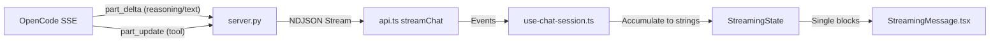

# Chat Feature Improvements Plan

## Problem Statement

The current chat implementation has two key issues:

1. **Fake chat history**: Messages are stored with a flat structure (`role`, `content`, `thinking`), but the `thinking` field is a single string that loses the sequential order of thinking → tool call → thinking patterns.

2. **Incorrect streaming render**: When backend streams `thinking → tool → thinking`, all thinking deltas get accumulated into a single thinking bubble. The UI should show separate bubbles for each thinking/tool segment in order.

## Root Cause Analysis

### Current Data Flow



### Problems by Layer

| Layer        | File                               | Issue                                                         |
| ------------ | ---------------------------------- | ------------------------------------------------------------- |
| **Types**    | `lib/types.ts`                     | `ChatMessage.thinking` is `string`, not `MessagePart[]`       |
| **Hook**     | `hooks/use-chat-session.ts`        | `StreamingState` accumulates all thinking into one string     |
| **Backend**  | `server/server.py`                 | Stores messages as `{content, thinking}` losing part ordering |
| **Frontend** | `components/streaming-message.tsx` | Renders one thinking block, not interleaved parts             |

---

## Proposed Changes

### Phase 1: Data Model Enhancement

Introduce a **message parts** model that preserves the order of thinking, tool calls, and text.

---

#### [MODIFY] [types.ts](file:///Users/mike/Project/GitHub/v0-research-agent-mobile/lib/types.ts)

Add new types for message parts:

```typescript
export type MessagePartType = "thinking" | "tool" | "text";

export interface MessagePart {
  id: string;
  type: MessagePartType;
  content: string;
  // For tool parts
  toolName?: string;
  toolState?: "pending" | "running" | "completed" | "error";
}

export interface ChatMessage {
  id: string;
  role: "user" | "assistant";
  content: string; // Legacy: plain text content (for backward compat)
  thinking?: string; // Legacy: combined thinking (for backward compat)
  parts?: MessagePart[]; // NEW: ordered array of parts
  timestamp: Date;
  // ... existing fields
}
```

---

#### [MODIFY] [api.ts](file:///Users/mike/Project/GitHub/v0-research-agent-mobile/lib/api.ts)

Update `ChatMessageData` to include optional parts:

```typescript
export interface ChatMessageData {
  role: "user" | "assistant";
  content: string;
  thinking?: string | null;
  parts?: MessagePart[] | null; // NEW
  timestamp: number;
}
```

---

### Phase 2: Streaming State Refactor

Change `StreamingState` to track an **ordered array of parts** instead of accumulating strings.

---

#### [MODIFY] [use-chat-session.ts](file:///Users/mike/Project/GitHub/v0-research-agent-mobile/hooks/use-chat-session.ts)

```typescript
export interface StreamingPart {
  id: string;
  type: "thinking" | "tool" | "text";
  content: string;
  toolName?: string;
  toolState?: "pending" | "running" | "completed" | "error";
}

export interface StreamingState {
  isStreaming: boolean;
  parts: StreamingPart[]; // Ordered array of parts
  // Legacy for backward compat
  thinkingContent: string;
  textContent: string;
  toolCalls: ToolCallState[];
}
```

Update `sendMessage` to track parts by their `id`:

> [!IMPORTANT]
> OpenCode assigns a **unique ID to each distinct part**. When the model switches from thinking → tool → thinking again, each segment gets a **different ID**. The algorithm is purely ID-based, NOT type-change-based.

**Part Tracking Algorithm:**

```typescript
// In sendMessage, process each stream event:
function processStreamEvent(
  event: StreamEvent,
  parts: StreamingPart[],
): StreamingPart[] {
  const partId = event.id;
  const ptype = event.ptype; // 'text' | 'reasoning' | 'tool'

  // Handle missing ID (shouldn't happen, but be defensive)
  if (!partId) {
    console.warn("Event missing part ID, skipping:", event);
    return parts;
  }

  // Find existing part with this ID
  const existingIndex = parts.findIndex((p) => p.id === partId);

  if (event.type === "part_delta") {
    // Text or reasoning delta
    const partType = ptype === "reasoning" ? "thinking" : "text";

    if (existingIndex >= 0) {
      // APPEND to existing part (same ID = same part)
      const updated = [...parts];
      updated[existingIndex] = {
        ...updated[existingIndex],
        content: updated[existingIndex].content + (event.delta || ""),
      };
      return updated;
    } else {
      // NEW part (new ID = new segment)
      return [
        ...parts,
        {
          id: partId,
          type: partType,
          content: event.delta || "",
        },
      ];
    }
  }

  if (event.type === "part_update" && ptype === "tool") {
    // Tool status update
    if (existingIndex >= 0) {
      // Update existing tool's state
      const updated = [...parts];
      updated[existingIndex] = {
        ...updated[existingIndex],
        toolState: event.state as ToolCallState["state"],
        toolName: event.name || updated[existingIndex].toolName,
      };
      return updated;
    } else {
      // New tool part
      return [
        ...parts,
        {
          id: partId,
          type: "tool",
          content: "",
          toolName: event.name,
          toolState: (event.state as ToolCallState["state"]) || "pending",
        },
      ];
    }
  }

  return parts;
}
```

**Key Invariants:**

1. **Same ID → same part**: If we see the same ID again, we append content or update state.
2. **New ID → new part**: A new ID means a new segment (could be same type or different type).
3. **Order preservation**: Parts are appended in the order they first appear.
4. **Type is immutable per ID**: Once a part is created with a type, it keeps that type (OpenCode guarantees this).

**Example Event Sequence:**

```
Event: {id: "abc", ptype: "reasoning", delta: "Let me think..."} → Create parts[0] = {id:"abc", type:"thinking"}
Event: {id: "abc", ptype: "reasoning", delta: " about this"}   → Append to parts[0]
Event: {id: "def", ptype: "tool", name: "grep", state: "running"} → Create parts[1] = {id:"def", type:"tool"}
Event: {id: "def", ptype: "tool", name: "grep", state: "completed"} → Update parts[1].toolState
Event: {id: "ghi", ptype: "reasoning", delta: "Based on..."}    → Create parts[2] = {id:"ghi", type:"thinking"} ← NEW thinking part!
Event: {id: "jkl", ptype: "text", delta: "Here's my answer:"}  → Create parts[3] = {id:"jkl", type:"text"}
```

---

### Phase 3: Backend Persistence

Update the backend to store and retrieve message parts.

---

#### [MODIFY] [server.py](file:///Users/mike/Project/GitHub/v0-research-agent-mobile/server/server.py)

1. **Stream parsing**: Track parts by `id` in `response_generator()`:

```python
parts = []  # List of {"id", "type", "content", "tool_name", "tool_state"}
current_part_id = None

async for event, text_delta, thinking_delta in stream_opencode_events(...):
    part_id = event.get("id")
    ptype = event.get("ptype")

    if ptype in ("text", "reasoning"):
        # Find or create part
        part = next((p for p in parts if p["id"] == part_id), None)
        if not part:
            part = {"id": part_id, "type": "thinking" if ptype == "reasoning" else "text", "content": ""}
            parts.append(part)
        part["content"] += event.get("delta", "")
    elif ptype == "tool":
        # Tool part
        part = next((p for p in parts if p["id"] == part_id), None)
        if not part:
            part = {"id": part_id, "type": "tool", "content": "", "tool_name": event.get("name"), "tool_state": event.get("state")}
            parts.append(part)
        else:
            part["tool_state"] = event.get("state")
```

2. **Persistence**: Store `parts` array in the assistant message:

```python
assistant_msg = {
    "role": "assistant",
    "content": full_text.strip(),
    "thinking": full_thinking.strip() if full_thinking else None,
    "parts": parts,  # NEW
    "timestamp": time.time()
}
```

---

### Phase 4: Frontend Rendering

Update `StreamingMessage` and `ChatMessage` to render parts in order.

---

#### [MODIFY] [streaming-message.tsx](file:///Users/mike/Project/GitHub/v0-research-agent-mobile/components/streaming-message.tsx)

Render parts in order instead of separate thinking/tool/text blocks:

```tsx
export function StreamingMessage({ streamingState }: StreamingMessageProps) {
  const { isStreaming, parts } = streamingState;

  return (
    <div className="px-0.5 py-2">
      <div className="space-y-2">
        {parts.map((part) => {
          if (part.type === "thinking") {
            return (
              <ThinkingPart key={part.id} content={part.content} isStreaming />
            );
          }
          if (part.type === "tool") {
            return <ToolCallIndicator key={part.id} tool={part} />;
          }
          if (part.type === "text") {
            return (
              <TextPart key={part.id} content={part.content} isStreaming />
            );
          }
        })}
        {/* Loading indicator when no parts yet */}
        {parts.length === 0 && isStreaming && <LoadingIndicator />}
      </div>
    </div>
  );
}
```

---

#### [MODIFY] [chat-message.tsx](file:///Users/mike/Project/GitHub/v0-research-agent-mobile/components/chat-message.tsx)

For saved messages, render from `parts` array if available, fall back to legacy `thinking`/`content`:

```tsx
// For assistant messages with parts
if (message.parts?.length) {
  return (
    <div className="space-y-2">
      {message.parts.map((part) => {
        if (part.type === "thinking")
          return <ThinkingBlock key={part.id} content={part.content} />;
        if (part.type === "tool") return <ToolBlock key={part.id} {...part} />;
        if (part.type === "text")
          return <TextBlock key={part.id} content={part.content} />;
      })}
    </div>
  );
}

// Legacy fallback
return (
  <>
    {message.thinking && <ThinkingBlock content={message.thinking} />}
    <TextBlock content={message.content} />
  </>
);
```

---

## Implementation Phases

| Phase | Description              | Files Changed                               | Estimated Effort |
| ----- | ------------------------ | ------------------------------------------- | ---------------- |
| **1** | Data model types         | `types.ts`, `api.ts`                        | Small            |
| **2** | Streaming state refactor | `use-chat-session.ts`                       | Medium           |
| **3** | Backend persistence      | `server.py`                                 | Medium           |
| **4** | Frontend rendering       | `streaming-message.tsx`, `chat-message.tsx` | Medium           |

> [!TIP]
> Start with Phase 1 + 2, which enables correct streaming render. Phase 3 can be done in parallel or after. Phase 4 ties it all together.

---

## Verification Plan

### Manual Testing

Since there is no existing automated test suite for chat, verification will be manual:

1. **Start the servers**:

   ```bash
   # Terminal 1: Start backend
   cd /Users/mike/Project/GitHub/v0-research-agent-mobile/server
   python server.py --workdir /Users/mike/Project/GitHub/v0-research-agent-mobile

   # Terminal 2: Start frontend
   cd /Users/mike/Project/GitHub/v0-research-agent-mobile
   npm run dev
   ```

2. **Open browser at `http://localhost:3000`**

3. **Test streaming render**:
   - Send a message that triggers thinking → tool → thinking (e.g., "search the codebase for X")
   - **Expected**: See interleaved bubbles: [Thinking...] → [Tool: search ✓] → [Thinking...] → [Response text]
   - **Current bug**: All thinking merged into single [Thinking...] bubble

4. **Test history persistence**:
   - Refresh the page after a chat
   - **Expected**: Previous messages render with correct interleaved parts
   - **Current bug**: Only shows combined thinking block

### Browser Automation (Future)

Could add Playwright tests to automate:

- Stream event mocking
- Part rendering verification

---

## Open Questions for User

1. **Backward compatibility**: Should we migrate existing chat history data, or just support new format going forward?

2. **Tool call details**: Should we store/display tool call arguments and results, or just name and status?

3. **Collapsed vs expanded**: For saved messages, should thinking blocks default to collapsed (current) or show first few lines?
