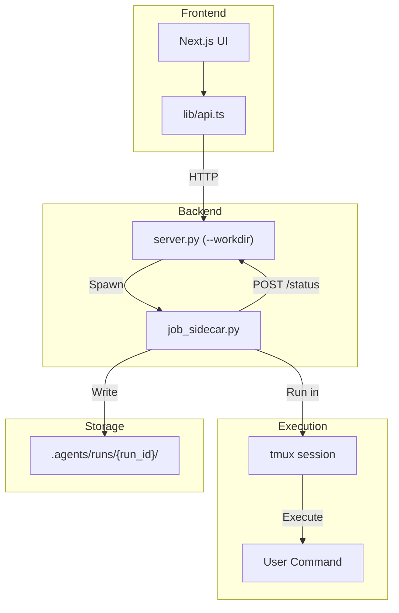

# Tmux Job Scheduling Feature

## Overview

**Goal**: Enable users to create runs in "queued" mode from the frontend, start them via tmux-managed subprocesses, with real-time status monitoring, log viewing, and terminal access.



---

## Design Decisions

### 1. Server Configuration

The server accepts a `--workdir` argument to specify the working directory for all runs and data storage.

```bash
python server.py --workdir /path/to/project
# Default: current directory
```

All paths (`.agents/`, logs, artifacts) are relative to this workdir.

---

### 2. Run Lifecycle (No Deletion)

Runs are **never deleted**, only transitioned through states:

| Status | Description |
|--------|-------------|
| `ready` | ✅ Created but not yet submitted for execution |
| `queued` | ✅ Submitted, waiting to be started |
| `launching` | ✅ Spawning sidecar in tmux |
| `running` | ✅ Command executing |
| `finished` | ✅ Completed successfully (exit 0) |
| `failed` | ✅ Completed with error |
| `stopped` | ✅ Manually canceled |

```
ready → queued → launching → running → finished/failed/stopped
  │         │
  └─────────┴── /runs/{id}/start (direct) or /runs/{id}/queue then /start
```

Runs can be **archived** (hidden from default view) but never removed.

---

### 3. Log Management

**Storage**: `.agents/runs/{run_id}/run.log`

**Capture**: `tmux pipe-pane` streams output to file in real-time.

**API Design for Performance**:

```
GET /runs/{run_id}/logs?offset=-1000&limit=100
```

| Parameter | Description |
|-----------|-------------|
| `offset` | Byte offset. Negative = from end. `0` = from start. |
| `limit` | Max bytes to return (default 10KB, max 100KB) |

Response:
```json
{
  "content": "...",
  "offset": 50000,
  "total_size": 60000,
  "has_more_before": true,
  "has_more_after": false
}
```

**Streaming** (SSE for live logs):
```
GET /runs/{run_id}/logs/stream
```
Returns `text/event-stream` with new log lines as they appear.

---

### 4. Artifact Management

**Storage**: `.agents/runs/{run_id}/artifacts/` (symlinks)

**Auto-discovery**: WandB dirs, checkpoints (`.pt`, `.pth`), metrics (`.jsonl`)

---

### 5. Frontend: Real Data (No Mock)

Replace mock data imports with API calls. Keep mock data file for reference/fallback only.

**Data Flow**:
```
NavPage
  └── RunsView (fetches from /runs)
        └── RunDetailView (receives run from parent)
              └── LogViewer (fetches from /runs/{id}/logs)
              └── TmuxTerminalPanel (placeholder)
```

---

## API Endpoints

### Runs ✅

| Endpoint | Method | Description |
|----------|--------|-------------|
| `/runs` | GET | List runs (`?archived=false&limit=50`) |
| `/runs` | POST | Create run (ready or queued) |
| `/runs/{id}` | GET | Get run details |
| `/runs/{id}/queue` | POST | Move ready → queued |
| `/runs/{id}/start` | POST | Start queued/ready run |
| `/runs/{id}/stop` | POST | Stop running job |
| `/runs/{id}/archive` | POST | Archive run |
| `/runs/{id}/unarchive` | POST | Unarchive run |
| `/runs/{id}/status` | POST | Sidecar callback |

### Sweeps ✅

| Endpoint | Method | Description |
|----------|--------|-------------|
| `/sweeps` | GET | List sweeps |
| `/sweeps` | POST | Create sweep with child runs |
| `/sweeps/{id}` | GET | Get sweep details |
| `/sweeps/{id}/start` | POST | Start sweep runs (`?parallel=N`) |

### Logs ✅

| Endpoint | Method | Description |
|----------|--------|-------------|
| `/runs/{id}/logs` | GET | Get logs (paginated by byte offset) |
| `/runs/{id}/logs/stream` | GET | SSE stream for live logs |

### Artifacts

| Endpoint | Method | Description |
|----------|--------|-------------|
| `/runs/{id}/artifacts` | GET | List artifacts |

---

## Frontend Components

### New: LogViewer

**Features**:
- Bottom-up display (newest at bottom, scroll up for history)
- Lazy loading: scrolling up requests more content via offset
- "Stream" button: enables live SSE streaming
- "Expand" button: opens full-page log view
- Monospace font, syntax highlighting for errors

**Implementation**:
```tsx
// components/log-viewer.tsx
interface LogViewerProps {
  runId: string
  isFullPage?: boolean
  onExpand?: () => void
}
```

---

### New: TmuxTerminalPanel

**Features**:
- Shows tmux window name (e.g., `ra-job-abc123`)
- "Copy Window Name" button for terminal access
- Placeholder UI for future embedded terminal
- Instructions: "Attach with: `tmux attach -t research-agent:ra-job-abc123`"

```tsx
// components/tmux-terminal-panel.tsx
interface TmuxTerminalPanelProps {
  runId: string
  tmuxWindow?: string // e.g., "ra-job-abc123"
  tmuxPane?: string   // e.g., "%5"
  onAttach?: () => void // Future: embedded terminal
}
```

**UI Mockup**:
```
┌─────────────────────────────────────────────┐
│ 🖥️ Terminal: ra-job-abc123                  │
├─────────────────────────────────────────────┤
│                                             │
│   [Placeholder for embedded terminal]       │
│                                             │
│   To attach manually:                       │
│   $ tmux attach -t research-agent:window    │
│                                             │
├─────────────────────────────────────────────┤
│ [📋 Copy Window Name] [🔗 Attach (Coming)]  │
└─────────────────────────────────────────────┘
```

---

### Modified: RunDetailView

Add two new collapsible sections:

1. **Logs Section** (above Command)
   - LogViewer component
   - "Expand" button → full page
   - "Stream" toggle for live updates

2. **Terminal Section** (below Logs)
   - TmuxTerminalPanel component
   - Shows tmux window info
   - Copy button

---

## Implementation Plan

### Phase 1: Backend Core

#### [MODIFY] [server.py](file:///Users/mike/Project/GitHub/v0-research-agent-mobile/server/server.py)

1. Add `--workdir` CLI argument (argparse)
2. Add `libtmux` dependency, tmux session management
3. Add run state persistence (`jobs.json`)
4. Add all run endpoints
5. Add log endpoints with offset-based pagination
6. Add SSE endpoint for log streaming

#### [NEW] [job_sidecar.py](file:///Users/mike/Project/GitHub/v0-research-agent-mobile/server/job_sidecar.py)

Port from `server-tmp/job_sidecar.py` with:
- Log capture via `pipe-pane`
- Status reporting
- WandB detection

---

### Phase 2: Frontend API

#### [MODIFY] [api.ts](file:///Users/mike/Project/GitHub/v0-research-agent-mobile/lib/api.ts)

Add run management functions:
- `listRuns(archived?: boolean)`
- `createRun({name, command, workdir?})`
- `startRun(id)`, `stopRun(id)`, `archiveRun(id)`
- `getRunLogs(id, offset?, limit?)`
- `streamRunLogs(id)` → returns ReadableStream

---

### Phase 3: Frontend Components

#### [NEW] [log-viewer.tsx](file:///Users/mike/Project/GitHub/v0-research-agent-mobile/components/log-viewer.tsx)

- Bottom-up log display
- IntersectionObserver for scroll-up loading
- SSE streaming toggle
- Expand to full page

#### [NEW] [tmux-terminal-panel.tsx](file:///Users/mike/Project/GitHub/v0-research-agent-mobile/components/tmux-terminal-panel.tsx)

- Display tmux window info
- Copy window name button
- Placeholder for future terminal embed

#### [MODIFY] [run-detail-view.tsx](file:///Users/mike/Project/GitHub/v0-research-agent-mobile/components/run-detail-view.tsx)

- Add LogViewer section
- Add TmuxTerminalPanel section
- Connect to real API

---

### Phase 4: Replace Mock Data

#### [MODIFY] [runs-view.tsx](file:///Users/mike/Project/GitHub/v0-research-agent-mobile/components/runs-view.tsx)

- Replace `mockRuns` import with `useEffect` + `listRuns()` API call
- Add polling for status updates (5s interval when runs are active)
- Add "Create Run" button + dialog
- Add "Start" / "Stop" buttons per run

#### [MODIFY] [nav-page.tsx](file:///Users/mike/Project/GitHub/v0-research-agent-mobile/components/nav-page.tsx)

- Wire up run data from API instead of mock

---

## Verification Plan

1. **Server workdir**: Start with `--workdir /tmp/test`, verify `.agents/` created there
2. **Create run**: API returns queued run, appears in UI
3. **Start run**: tmux window created, status → running
4. **View logs**: Scroll up loads more, stream shows live output
5. **Copy tmux window**: Clipboard contains correct window name
6. **Stop run**: Window killed, status → stopped, logs preserved
7. **Archive**: Run hidden from default list

---

## Dependencies

**Python** (add to `server/requirements.txt`):
```
libtmux>=0.32.0
```

---

## Open Questions

1. **Embedded terminal**: Use xterm.js + WebSocket proxy? (Future)
2. **Log size limits**: Truncate logs over 100MB? (For MVP, no limit)
