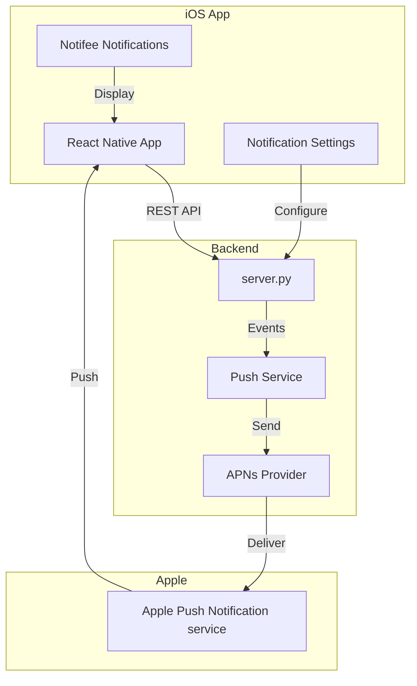

# iOS React Native App Plan

## Overview

**Goal**: Build a native iOS app with React Native that connects to the Research Agent backend, featuring fully user-customizable push notifications for ML experiment monitoring.



---

## Tech Stack

| Component | Technology |
|-----------|------------|
| **Framework** | React Native 0.73+ |
| **Build System** | Expo (managed workflow) + EAS Build |
| **Notifications** | [@notifee/react-native](https://notifee.app/) |
| **Push Backend** | Firebase Cloud Messaging (FCM) → APNs |
| **State** | React Query (TanStack Query) |
| **Navigation** | React Navigation 6 |
| **Storage** | AsyncStorage / MMKV |

---

## User-Customizable Notifications

### Notification Types

Users can independently enable/disable each:

| Type | Description | Default |
|------|-------------|---------|
| `run_started` | Run begins execution | Off |
| `run_completed` | Run finishes successfully | On |
| `run_failed` | Run fails with error | On |
| `run_stopped` | Run manually stopped | Off |
| `alert_critical` | Critical priority alerts | On |
| `alert_high` | High priority alerts | On |
| `alert_medium` | Medium priority alerts | Off |
| `alert_low` | Low priority alerts | Off |
| `chat_reply` | AI responds to your message | On |
| `sweep_complete` | All sweep runs finished | On |

### Per-Notification Customization

Each notification type can be customized:

```typescript
interface NotificationPreference {
  enabled: boolean
  sound: 'default' | 'success' | 'error' | 'alert' | 'none'
  vibration: boolean
  showInLockScreen: boolean
  badge: boolean
  priority: 'high' | 'default' | 'low'
  grouping: boolean  // Group by run/sweep
}
```

### Notification Settings UI

```
┌─────────────────────────────────────────────┐
│ 🔔 Notification Settings                    │
├─────────────────────────────────────────────┤
│                                             │
│ RUN EVENTS                                  │
│ ┌─────────────────────────────────────────┐ │
│ │ ✅ Run Completed              [⚙️]     │ │
│ │ ✅ Run Failed                 [⚙️]     │ │
│ │ ⬜ Run Started                [⚙️]     │ │
│ │ ⬜ Run Stopped                [⚙️]     │ │
│ └─────────────────────────────────────────┘ │
│                                             │
│ ALERTS                                      │
│ ┌─────────────────────────────────────────┐ │
│ │ ✅ Critical Alerts            [⚙️]     │ │
│ │ ✅ High Priority              [⚙️]     │ │
│ │ ⬜ Medium Priority            [⚙️]     │ │
│ │ ⬜ Low Priority               [⚙️]     │ │
│ └─────────────────────────────────────────┘ │
│                                             │
│ CHAT                                        │
│ ┌─────────────────────────────────────────┐ │
│ │ ✅ AI Replies                 [⚙️]     │ │
│ └─────────────────────────────────────────┘ │
│                                             │
│ [⚙️] = Customize sound, vibration, etc.    │
└─────────────────────────────────────────────┘
```

---

## Rich Notification Examples

### Run Completed (with progress image)

```
┌─────────────────────────────────────────────┐
│ ✅ Run Completed                        now │
│ train-gpt-large                             │
│                                             │
│ Duration: 2h 34m                            │
│ Final Loss: 0.0234                          │
│ Accuracy: 94.2%                             │
│                                             │
│ [📊 View Charts]  [📝 View Logs]            │
└─────────────────────────────────────────────┘
```

### Run Failed (with error details)

```
┌─────────────────────────────────────────────┐
│ ❌ Run Failed                          2m   │
│ train-transformer-v2                        │
│                                             │
│ CUDA out of memory                          │
│ Allocating 2.5GB on GPU 0                   │
│                                             │
│ [🔄 Restart]  [📝 View Logs]  [❌ Dismiss]  │
└─────────────────────────────────────────────┘
```

### Alert with Actions

```
┌─────────────────────────────────────────────┐
│ ⚠️ Loss Spike Detected                 5m   │
│ train-bert-finetune                         │
│                                             │
│ Loss jumped from 0.45 → 2.34                │
│ This may indicate gradient explosion        │
│                                             │
│ [👀 Acknowledge]  [🛑 Stop Run]             │
└─────────────────────────────────────────────┘
```

---

## Project Structure

```
ios-app/
├── app.json                    # Expo config
├── eas.json                    # EAS Build config
├── src/
│   ├── screens/
│   │   ├── ChatScreen.tsx
│   │   ├── RunsScreen.tsx
│   │   ├── RunDetailScreen.tsx
│   │   ├── ChartsScreen.tsx
│   │   ├── SettingsScreen.tsx
│   │   └── NotificationSettingsScreen.tsx
│   ├── components/
│   │   ├── ChatBubble.tsx
│   │   ├── RunCard.tsx
│   │   ├── NotificationPreferenceRow.tsx
│   │   └── ...
│   ├── services/
│   │   ├── api.ts              # REST API client
│   │   ├── notifications.ts    # Notifee setup
│   │   └── push.ts             # FCM/APNs registration
│   ├── stores/
│   │   ├── notificationPrefs.ts
│   │   └── authStore.ts
│   └── navigation/
│       └── RootNavigator.tsx
└── ios/                        # Native iOS code (if needed)
```

---

## Implementation Phases

### Phase 1: Project Setup

- [ ] Initialize Expo project with TypeScript
- [ ] Configure EAS Build for iOS
- [ ] Set up React Navigation
- [ ] Install and configure Notifee
- [ ] Set up Firebase project for FCM

### Phase 2: Core Screens

Port key screens from web app:

- [ ] Chat screen (reuse chat logic)
- [ ] Runs list screen
- [ ] Run detail screen
- [ ] Basic settings screen

### Phase 3: Push Notification Infrastructure

#### Backend Changes

**[MODIFY] server.py**
- Add `/devices/register` endpoint for push tokens
- Add `/devices/unregister` endpoint
- Add `/notifications/preferences` GET/PUT endpoints

**[NEW] push_service.py**
- FCM integration for sending push notifications
- Notification payload builders
- Device token management

#### iOS App

- [ ] FCM/APNs setup in Expo
- [ ] Token registration on app start
- [ ] Background notification handlers
- [ ] Foreground notification display with Notifee

### Phase 4: Notification Settings UI

- [ ] NotificationSettingsScreen with all toggles
- [ ] Per-type customization modal (sound, vibration, etc.)
- [ ] Sound picker with preview
- [ ] Sync preferences to backend

### Phase 5: Rich Notifications

- [ ] Notification Service Extension (for images)
- [ ] Action buttons (View, Stop, Acknowledge)
- [ ] Notification grouping by run/sweep
- [ ] Badge count management

---

## Backend API Additions

### Device Registration

```
POST /devices/register
{
  "token": "fcm-device-token",
  "platform": "ios",
  "device_name": "Mike's iPhone"
}

DELETE /devices/{token}
```

### Notification Preferences

```
GET /notifications/preferences
→ Returns all notification preferences for user

PUT /notifications/preferences
{
  "run_completed": { "enabled": true, "sound": "success", ... },
  "run_failed": { "enabled": true, "sound": "error", ... },
  ...
}
```

### Trigger Points (server.py modifications)

Send push notifications when:
- `update_run_status()` → run state changes
- Alert created → based on priority
- Chat response complete → if from mobile session

---

## Dependencies

### React Native (package.json)

```json
{
  "dependencies": {
    "expo": "~50.0.0",
    "@notifee/react-native": "^7.8.0",
    "@react-native-firebase/app": "^18.0.0",
    "@react-native-firebase/messaging": "^18.0.0",
    "@react-navigation/native": "^6.0.0",
    "@react-navigation/bottom-tabs": "^6.0.0",
    "@tanstack/react-query": "^5.0.0",
    "react-native-mmkv": "^2.11.0"
  }
}
```

### Python (server/requirements.txt)

```
firebase-admin>=6.0.0  # For sending FCM messages
```

---

## Firebase Setup (Required)

1. Create Firebase project at [console.firebase.google.com](https://console.firebase.google.com)
2. Add iOS app with bundle ID
3. Download `GoogleService-Info.plist`
4. Enable Cloud Messaging
5. Generate APNs key in Apple Developer Portal
6. Upload APNs key to Firebase

---

## Verification Plan

### Unit Tests
- Notification preference persistence
- API client functions
- Push token registration

### Integration Tests
- End-to-end push notification flow
- Notification action handling
- Background message processing

### Manual Testing Checklist
- [ ] App installs and runs on iOS device
- [ ] Push permission prompt appears
- [ ] Token registered with backend
- [ ] Run completion triggers notification
- [ ] Notification sound plays correctly
- [ ] Action buttons work (View, Stop)
- [ ] Preferences sync across app restart
- [ ] Background notifications arrive
- [ ] Notification grouping works
- [ ] Badge count accurate

---

## Timeline Estimate

| Phase | Effort | Description |
|-------|--------|-------------|
| Phase 1 | 2-3h | Project setup + config |
| Phase 2 | 4-6h | Core screens |
| Phase 3 | 3-4h | Push infrastructure |
| Phase 4 | 2-3h | Settings UI |
| Phase 5 | 3-4h | Rich notifications |
| Testing | 2h | Manual + automated |

**Total**: ~16-22 hours

---

## Open Questions

1. **Bundle ID**: What bundle ID should we use? (e.g., `com.yourname.researchagent`)

2. **Apple Developer Account**: Do you have one for push notification provisioning?

3. **Backend Hosting**: Where is the server deployed? (needed for push callback URL)

4. **Offline Support**: Should the app work offline with cached data?
