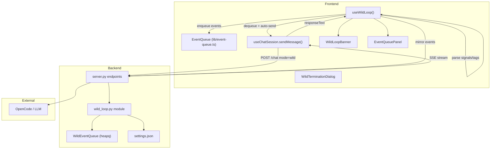
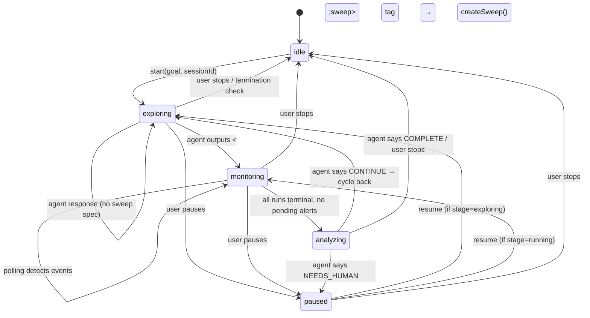

# Wild Loop — Technical Architecture

> Autonomous research loop that drives experiment exploration, monitoring, and analysis without human input.

---

## Table of Contents

1. [Overview](#overview)
2. [System Architecture](#system-architecture)
3. [State Machine](#state-machine)
4. [Priority Event Queue](#priority-event-queue)
5. [Backend Module (`wild_loop.py`)](#backend-module)
6. [Frontend Hook (`use-wild-loop.ts`)](#frontend-hook)
7. [API Endpoints](#api-endpoints)
8. [Prompt Protocol](#prompt-protocol)
9. [Signal Protocol](#signal-protocol)
10. [Agent Output Tags](#agent-output-tags)
11. [Persistence & Serialization](#persistence--serialization)
12. [UI Components](#ui-components)
13. [Mode Registry](#mode-registry)
14. [File Map](#file-map)

---

## Overview

The Wild Loop ("Wild Mode") is an autonomous agent loop that:

1. **Explores** — sends iterative prompts to the LLM to plan and design experiments
2. **Monitors** — watches running sweeps/runs, reacting to alerts and terminal states
3. **Analyzes** — when all runs complete, asks the agent to evaluate results
4. **Cycles** — if the goal isn't met, returns to exploring for another iteration

The loop is **frontend-driven** (v3 "Ralph Wiggum" pattern): the React hook orchestrates when to send prompts and processes responses, while the backend provides stateless API endpoints and state persistence.

---

## System Architecture



### Data Flow (One Iteration)

1. Hook dequeues the top event from `EventQueue`
2. Its `.prompt` becomes `pendingPrompt`
3. `connected-chat-view` detects `pendingPrompt` and calls `sendMessage(prompt, 'wild', sessionId)`
4. Backend's `_build_chat_prompt()` prepends the wild system prompt via `MODE_REGISTRY`
5. LLM streams a response via SSE
6. On stream end, `onResponseComplete(responseText)` fires
7. Hook parses signals (`<signal>CONTINUE</signal>`) and action tags (`<sweep>`, `<resolve_alert>`)
8. Hook enqueues the next event based on current stage
9. Loop repeats from step 1

---

## State Machine



### Phase vs Stage

| Concept                     | Values                                                                                    | Purpose                                                |
| --------------------------- | ----------------------------------------------------------------------------------------- | ------------------------------------------------------ |
| **Phase** (`WildLoopPhase`) | `idle`, `exploring`, `monitoring`, `analyzing`, `complete`, `paused`, `waiting_for_human` | User-facing state shown in banner                      |
| **Stage** (`WildLoopStage`) | `exploring`, `running`, `analyzing`                                                       | Internal stage that determines prompt/polling behavior |

Phase tracks what the user sees; stage tracks what the hook does. When paused, stage is preserved so resume knows where to return.

---

## Priority Event Queue

Events are sorted by `(priority ASC, createdAt ASC)`. Lower priority number = higher urgency.

### Priority Levels

| Priority | Label     | Color  | Source                      | Use Case                              |
| -------- | --------- | ------ | --------------------------- | ------------------------------------- |
| **10**   | User      | Red    | User input (`steer`)        | User types a message during wild mode |
| **20**   | Critical  | Orange | `auto_enqueue_alert`        | Critical severity alert               |
| **30**   | Warning   | Yellow | `auto_enqueue_alert`        | Warning severity alert                |
| **40**   | —         | —      | `auto_enqueue_run_terminal` | Failed run                            |
| **50**   | Run Event | Blue   | `auto_enqueue_run_terminal` | Finished run                          |
| **70**   | Analysis  | Violet | Stage transition            | All runs terminal → analysis prompt   |
| **90**   | Exploring | Gray   | Timer / resume              | Exploratory iteration prompt          |

### Deduplication

Both frontend `EventQueue` and backend `WildEventQueue` dedup by event `id`. IDs follow conventions:

- Alerts: `alert-{alert_id}`
- Run events: `run-{run_id}-{status}`
- Exploring: `explore-{iteration}-{timestamp}`
- Analysis: `analysis-{sweep_id}-{timestamp}`
- User steer: `steer-{timestamp}`

### Frontend Queue (`lib/event-queue.ts`)

- Array-based sorted insert (binary search)
- Supports `reorder(orderedIds)` for drag-and-drop override
- Supports `insertAt(event, index)` for manual placement
- Exposed to UI via `EventQueuePanel`

### Backend Queue (`wild_loop.py`)

- `heapq`-based with `(priority, created_at, counter)` tuple for stable ordering
- Auto-enqueue triggered by `create_alert` and `update_run_status` handlers
- Queryable via `/wild/events/queue` for debugging

---

## Backend Module

**File:** [wild_loop.py](file:///Users/mike/Project/GitHub/v0-research-agent-mobile/server/wild_loop.py)

### Pydantic Models

| Model                   | Purpose                                                    |
| ----------------------- | ---------------------------------------------------------- |
| `WildModeRequest`       | `{enabled: bool}` — toggle wild mode                       |
| `WildLoopConfigRequest` | Set goal, session_id, and termination conditions           |
| `WildEvent`             | Event shape: id, priority, title, prompt, type, created_at |
| `EnqueueEventRequest`   | API request to enqueue: priority, title, prompt, type      |

### Module-Level State

```python
wild_mode_enabled: bool = False          # Global on/off toggle
wild_loop_state: dict = {                # Loop metadata
    "phase": "idle",
    "iteration": 0,
    "goal": None,
    "session_id": None,
    "started_at": None,
    "is_paused": False,
    "sweep_id": None,
    "termination": {
        "max_iterations": None,
        "max_time_seconds": None,
        "max_tokens": None,
        "custom_condition": None,
    }
}
wild_event_queue = WildEventQueue()      # Singleton queue instance
```

### Key Functions

| Function                                                       | Purpose                                                             |
| -------------------------------------------------------------- | ------------------------------------------------------------------- |
| `get_wild_mode_state()` / `set_wild_mode_state(enabled)`       | Toggle wild mode on/off                                             |
| `get_loop_status()` / `update_loop_status(...)`                | Read/write loop state fields                                        |
| `configure_loop(req)`                                          | Set termination conditions and goal                                 |
| `enqueue_event(req)` / `dequeue_event()`                       | Queue CRUD                                                          |
| `auto_enqueue_alert(...)`                                      | Called by `create_alert` handler — maps severity → priority         |
| `auto_enqueue_run_terminal(...)`                               | Called by `update_run_status` handler — failed=40, finished=50      |
| `build_experiment_context(runs, sweeps, alerts, recompute_fn)` | Builds the `--- Current Experiment State ---` block                 |
| `build_wild_prompt(render_fn, experiment_context)`             | Renders `wild_system` prompt skill with iteration, goal, sweep note |
| `get_serializable_state()` / `load_from_saved(data)`           | Persistence (deep-copied to avoid mutation bugs)                    |

---

## Frontend Hook

**File:** [use-wild-loop.ts](file:///Users/mike/Project/GitHub/v0-research-agent-mobile/hooks/use-wild-loop.ts)

### Hook API (`UseWildLoopResult`)

```typescript
{
  // State
  isActive, isPaused, phase, stage, iteration, goal, startedAt,
  terminationConditions, sweepId, runStats, activeAlerts,

  // Actions
  start(goal, sessionId),  // Begin loop
  pause(),                 // Pause (preserves queue)
  resume(),                // Resume from current stage
  stop(),                  // Full reset
  setTerminationConditions(conditions),

  // Prompt lifecycle
  onResponseComplete(responseText),  // Parse signals/tags, advance state
  pendingPrompt,                     // Top of queue .prompt (read by connected-chat-view)
  consumePrompt(),                   // Dequeue after send

  // Queue API (for EventQueuePanel)
  eventQueue,
  reorderQueue(orderedIds),
  removeFromQueue(id),
  insertIntoQueue(event, index?),
}
```

### Prompt Builders

Each stage has a dedicated builder that accepts a goal, context data, and an optional prompt skill template:

| Builder                                                            | Stage      | Template ID       |
| ------------------------------------------------------------------ | ---------- | ----------------- |
| `buildExploringPrompt(goal, iteration, template?)`                 | Exploring  | `wild_exploring`  |
| `buildRunEventPrompt(goal, run, logTail, sweepSummary, template?)` | Monitoring | `wild_monitoring` |
| `buildAlertPrompt(goal, alert, runName, template?)`                | Monitoring | `wild_alert`      |
| `buildAnalysisPrompt(goal, runs, sweepName, template?)`            | Analyzing  | `wild_analyzing`  |

Templates use `{{variable}}` placeholders rendered by `renderTemplate()`. If no template is loaded, hardcoded fallbacks are used.

### Polling (Running Stage)

When `stage === 'running'` and `trackedSweepId` is set, a 5-second interval:

1. Fetches the sweep + its runs via API
2. Updates `runStats`
3. Detects new alerts → enqueues `alert` events (priority 20)
4. Detects run state transitions → enqueues `run_event` events (priority 40 or 50)
5. If all runs terminal + no pending alerts → transitions to `analyzing` stage

---

## API Endpoints

All endpoints require `X-Auth-Token` header.

### Wild Mode Toggle

| Method | Path         | Body              | Response          |
| ------ | ------------ | ----------------- | ----------------- |
| `GET`  | `/wild-mode` | —                 | `{enabled: bool}` |
| `POST` | `/wild-mode` | `{enabled: bool}` | `{enabled: bool}` |

### Loop State

| Method | Path              | Body                                                                                       | Response                    |
| ------ | ----------------- | ------------------------------------------------------------------------------------------ | --------------------------- |
| `GET`  | `/wild/status`    | —                                                                                          | Full `wild_loop_state` dict |
| `POST` | `/wild/status`    | `{phase?, iteration?, goal?, session_id?, is_paused?}`                                     | Updated state               |
| `POST` | `/wild/configure` | `{goal?, session_id?, max_iterations?, max_time_seconds?, max_tokens?, custom_condition?}` | Updated state               |

### Event Queue

| Method | Path                   | Body                              | Response                     |
| ------ | ---------------------- | --------------------------------- | ---------------------------- |
| `POST` | `/wild/events/enqueue` | `{priority, title, prompt, type}` | `{added, event, queue_size}` |
| `GET`  | `/wild/events/next`    | —                                 | `{event, queue_size}`        |
| `GET`  | `/wild/events/queue`   | —                                 | `{queue_size, events[]}`     |

### Chat (Mode-aware)

| Method | Path    | Body                                  | Notes                                            |
| ------ | ------- | ------------------------------------- | ------------------------------------------------ |
| `POST` | `/chat` | `{session_id, message, mode: "wild"}` | `_build_chat_prompt` prepends wild system prompt |

---

## Prompt Protocol

When `mode === "wild"`, the backend prepends a system preamble via `build_wild_prompt`:

```
[Wild mode iteration {N} / {max}]
Goal: {goal}

{experiment_context}

## Active Wild Sweep
Sweep ID: `{sweep_id}` — When creating new runs, use `sweep_id="{sweep_id}"` ...

{custom_condition}

[USER] {actual message from event queue}
```

The `experiment_context` block summarizes:

- Active/finished/failed run counts
- Sweep progress
- Pending alerts
- Current goal

---

## Signal Protocol

The agent embeds signals in its response text:

```xml
<signal>CONTINUE</signal>   <!-- Keep going, enqueue next prompt -->
<signal>COMPLETE</signal>    <!-- Goal achieved, stop loop -->
<signal>NEEDS_HUMAN</signal> <!-- Pause and wait for user input -->
```

Also accepts `<promise>` as an alias for `<signal>`.

Signals are parsed by `parseSignal()` in the frontend hook and acted upon in `onResponseComplete()`.

---

## Agent Output Tags

The agent can emit structured tags in its response for the frontend to act on:

### `<sweep>` — Create a Sweep

```xml
<sweep>
{
  "name": "LR sweep",
  "base_command": "python train.py",
  "workdir": "/workspace",
  "parameters": {"lr": ["1e-4", "1e-5"]},
  "max_runs": 4
}
</sweep>
```

Parsed by `parseSweepSpec()`. Frontend calls `createSweep()` → `startSweep()`, then transitions to `running` stage.

### `<resolve_alert>` — Respond to an Alert

```xml
<resolve_alert>
{"alert_id": "abc123", "choice": "Ignore"}
</resolve_alert>
```

Parsed by `parseAlertResolution()`. Frontend calls `respondToAlert(alertId, choice)`.

---

## Persistence & Serialization

State is persisted to `settings.json` via `save_settings_state()` / `load_settings_state()`:

```json
{
  "wild_mode": false,
  "wild_loop": {
    "phase": "idle",
    "iteration": 0,
    "goal": null,
    "termination": { ... }
  }
}
```

> [!IMPORTANT]
> `get_serializable_state()` returns a **deep copy** of `wild_loop_state`. This prevents mutations to the live state dict from corrupting saved snapshots — a bug that was fixed during v4 testing.

The event queue is **not** persisted — it is rebuilt from polling on reconnection.

---

## UI Components

| Component                 | File                                                                                                                             | Purpose                                                                                                           |
| ------------------------- | -------------------------------------------------------------------------------------------------------------------------------- | ----------------------------------------------------------------------------------------------------------------- |
| **WildLoopBanner**        | [wild-loop-banner.tsx](file:///Users/mike/Project/GitHub/v0-research-agent-mobile/components/wild-loop-banner.tsx)               | Top banner showing phase, iteration, elapsed time, run stats, and control buttons (pause/resume/stop/configure)   |
| **EventQueuePanel**       | [event-queue-panel.tsx](file:///Users/mike/Project/GitHub/v0-research-agent-mobile/components/event-queue-panel.tsx)             | Collapsible panel with drag-and-drop reordering (`@dnd-kit`), priority badges, type icons, and inline insert form |
| **WildTerminationDialog** | [wild-termination-dialog.tsx](file:///Users/mike/Project/GitHub/v0-research-agent-mobile/components/wild-termination-dialog.tsx) | Dialog for setting max iterations, max time, max tokens, and custom stop conditions                               |

---

## Mode Registry

**File:** [server.py](file:///Users/mike/Project/GitHub/v0-research-agent-mobile/server/server.py) (around line 2570)

The chat prompt builder uses a declarative `MODE_REGISTRY` instead of `if/elif` branches:

```python
MODE_REGISTRY: Dict[str, ModeConfig] = {
    "plan": ModeConfig(skill_id="ra_mode_plan", build_state=_build_plan_state),
    "wild": ModeConfig(skill_id=_WILD_SENTINEL, build_state=lambda _msg: {}),
}
```

Each mode maps a **prompt skill template ID** to a **state builder function** that returns template variables. The wild mode uses a sentinel value because it delegates to `build_wild_prompt()` with its own iteration/sweep logic.

Adding a new mode requires: 1 prompt skill template + 1 state builder function + 1 registry entry.

---

## File Map

| Layer        | File                                                                                                                                        | Lines | Description                                                        |
| ------------ | ------------------------------------------------------------------------------------------------------------------------------------------- | ----- | ------------------------------------------------------------------ |
| **Backend**  | [server/wild_loop.py](file:///Users/mike/Project/GitHub/v0-research-agent-mobile/server/wild_loop.py)                                       | 405   | Core module: models, queue, state, prompt builder, serialization   |
| **Backend**  | [server/server.py](file:///Users/mike/Project/GitHub/v0-research-agent-mobile/server/server.py)                                             | ~80   | Endpoint handlers delegating to wild_loop.py, MODE_REGISTRY        |
| **Frontend** | [hooks/use-wild-loop.ts](file:///Users/mike/Project/GitHub/v0-research-agent-mobile/hooks/use-wild-loop.ts)                                 | 785   | Main hook: state machine, signal parsing, prompt builders, polling |
| **Frontend** | [lib/event-queue.ts](file:///Users/mike/Project/GitHub/v0-research-agent-mobile/lib/event-queue.ts)                                         | 142   | Priority queue with drag-reorder support                           |
| **Frontend** | [components/event-queue-panel.tsx](file:///Users/mike/Project/GitHub/v0-research-agent-mobile/components/event-queue-panel.tsx)             | 303   | DnD queue UI                                                       |
| **Frontend** | [components/wild-loop-banner.tsx](file:///Users/mike/Project/GitHub/v0-research-agent-mobile/components/wild-loop-banner.tsx)               | 316   | Status banner                                                      |
| **Frontend** | [components/wild-termination-dialog.tsx](file:///Users/mike/Project/GitHub/v0-research-agent-mobile/components/wild-termination-dialog.tsx) | ~200  | Termination config dialog                                          |
| **Tests**    | [tests/wild_loop_test.py](file:///Users/mike/Project/GitHub/v0-research-agent-mobile/tests/wild_loop_test.py)                               | ~800  | 63 unit tests covering queue, state, serialization, prompts        |
