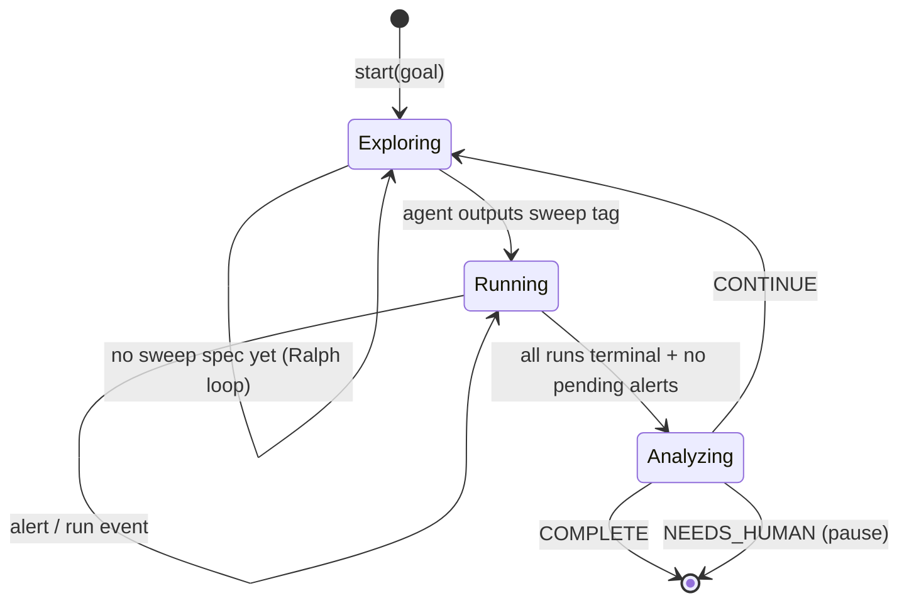

# Wild Loop State Machine

## Overview

The Wild Loop is a frontend-driven autonomous research loop that executes in 3 stages: **Exploring**, **Running**, and **Analyzing**. The agent never runs code directly — it outputs structured tags (`<sweep>`, `<resolve_alert>`) and the frontend calls the appropriate API endpoints.



---

## Key Files

| File                                                                                                                     | Role                                                               |
| ------------------------------------------------------------------------------------------------------------------------ | ------------------------------------------------------------------ |
| [use-wild-loop.ts](file:///Users/mike/Project/GitHub/v0-research-agent-mobile/hooks/use-wild-loop.ts)                    | State machine hook — stages, polling, prompt builders, tag parsers |
| [connected-chat-view.tsx](file:///Users/mike/Project/GitHub/v0-research-agent-mobile/components/connected-chat-view.tsx) | Consumes `pendingPrompt`, auto-sends with `mode='agent'`           |
| [wild-loop-banner.tsx](file:///Users/mike/Project/GitHub/v0-research-agent-mobile/components/wild-loop-banner.tsx)       | Displays phase, iteration, timer, run stats, alert count           |
| [types.ts](file:///Users/mike/Project/GitHub/v0-research-agent-mobile/lib/types.ts)                                      | `WildLoopPhase` type (includes `'exploring'`)                      |
| [api.ts](file:///Users/mike/Project/GitHub/v0-research-agent-mobile/lib/api.ts)                                          | `createSweep`, `startSweep`, `respondToAlert`, etc.                |

---

## Structured Output Tags

The agent communicates actions via XML tags in its response text. The frontend parses these in `onResponseComplete`.

### `<sweep>` — Create a Sweep (Exploring stage)

```json
<sweep>
{
  "name": "LR Sweep 1e-4 to 1e-2",
  "base_command": "python train_gpt2.py",
  "parameters": {
    "lr": [0.0001, 0.0003, 0.001, 0.003, 0.01]
  },
  "max_runs": 10
}
</sweep>
```

**Frontend action**: `parseSweepSpec()` → `createSweep(spec)` → `startSweep(id, 100)` (all parallel)

**Required fields**: `name`, `base_command`, `parameters`  
**Optional fields**: `workdir`, `max_runs`  
**Note**: `auto_start` is always forced to `false` — the frontend controls startup.

### `<resolve_alert>` — Resolve an Alert (Running stage)

```json
<resolve_alert>
{"alert_id": "abc123def456", "choice": "continue_training"}
</resolve_alert>
```

**Frontend action**: `parseAlertResolution()` → `respondToAlert(alertId, choice)`

The available choices come from the alert's `choices` array (e.g., `["Ignore", "Stop Job", "continue_training"]`).

### `<promise>` — Loop Control Signal (All stages)

```
<promise>CONTINUE</promise>   // Keep going
<promise>COMPLETE</promise>   // Goal achieved, stop loop
<promise>NEEDS_HUMAN</promise> // Pause for human input
```

---

## Stage Details

### 1. Exploring

**Purpose**: Agent understands the codebase and defines experiments.

**Prompt**: `buildExploringPrompt(goal, iteration)` — includes sweep JSON template with example.

**Loop behavior** (Ralph-style):

- Agent responds → `onResponseComplete` checks for `<sweep>` tag
- If `<sweep>` found: frontend creates sweep, starts all runs, transitions to **Running**
- If no `<sweep>`: re-sends exploring prompt after delay (1.5s first time, 3s after)

**Transition**: `parseSweepSpec()` returns non-null → `setStage('running')`

### 2. Running (Event-Driven)

**Purpose**: Monitor runs and handle alerts. No auto-prompting — the agent only receives prompts when something happens.

**Polling** (every 5s via `setInterval`):

1. Fetch sweep details + all runs + all alerts
2. Update run stats (running/completed/failed/queued counts)
3. Update active alerts badge
4. If `isBusyRef` is true (agent is streaming), skip event processing
5. Check for unprocessed **alerts first** (higher priority)
6. Check for **run status transitions** (finished/failed)
7. Check if **all terminal + no pending alerts** → transition to Analyzing

**Alert prompt**: `buildAlertPrompt()` — includes alert ID, severity, message, available choices, and `<resolve_alert>` template.

**Run event prompt**: `buildRunEventPrompt()` — includes run details, log tail (last 1000 chars), sweep summary.

**On response**: `parseAlertResolution()` → `respondToAlert()` if the agent resolved an alert.

**Transition guard**:

```typescript
const allTerminal = sweepRuns.every((r) =>
  ["finished", "failed", "stopped"].includes(r.status),
);
const hasUnprocessedAlerts = pendingAlerts.some(
  (a) => !processedAlertIdsRef.current.has(a.id),
);
if (allTerminal && !hasUnprocessedAlerts && pendingAlerts.length === 0) {
  // → ANALYZING
}
```

This is a **double guard** — `hasUnprocessedAlerts` checks our local tracking, and `pendingAlerts.length === 0` checks the server's ground truth (alerts might be in-flight to `respondToAlert` but not yet resolved server-side).

### 3. Analyzing

**Purpose**: Evaluate whether the research goal has been achieved.

**Prompt**: `buildAnalysisPrompt()` — includes run summary (pass/fail counts per run) and asks for CONTINUE/COMPLETE/NEEDS_HUMAN.

**Transitions**:

- `COMPLETE` → `stop()` — loop ends
- `NEEDS_HUMAN` → `pause()` — loop pauses for human input
- `CONTINUE` (or no signal) → resets to **Exploring** with fresh tracking state:
  - Snapshots existing sweep IDs
  - Clears `seenRunStatuses` and `processedAlertIds`
  - Sets `trackedSweepId = null`
  - Sends new exploring prompt after 3s delay

---

## Concurrency Model

### `isBusyRef` — Prompt Guard

Prevents polling from queuing new prompts while the agent is responding:

- Set to `true` when a prompt is queued (alert, run event, or stage transition)
- Set to `false` in `onResponseComplete`
- Polling checks `isBusyRef` before event processing but still updates stats/alerts for the banner

### One Event at a Time

The polling loop processes one event per cycle (returns early after queueing). This ensures:

- No prompt pile-up
- Agent can focus on one issue at a time
- Next event is picked up on the next poll (5s)

### No Dropped Alerts

Alerts cannot be dropped because:

1. Every poll re-fetches ALL pending alerts from the server
2. `processedAlertIdsRef` only tracks which we've already sent to the agent
3. New alerts appearing between polls are caught on the next cycle
4. The ANALYZING transition requires `pendingAlerts.length === 0` (server truth)

### Known edge case

If `respondToAlert()` fails, the alert stays `pending` on the server but is in `processedAlertIds`. The loop stays in Running forever (stuck, not dropped). Could add retry logic if this becomes a problem.

---

## Frontend Integration

### ConnectedChatView

Wild loop prompts are auto-sent with `mode='agent'` to skip the backend's `wild_mode` prompt injection:

```typescript
// connected-chat-view.tsx, ~line 147
await sendMessage(wildLoop.pendingPrompt!, "agent", sessionId);
wildLoop.consumePrompt();
```

The user's initial message is still sent with the UI-selected mode (e.g., `'wild'`), which triggers the backend's wild mode system prompt. Subsequent loop iterations use `'agent'` mode because the frontend now constructs all prompts.

### WildLoopBanner

Displays:

- **Phase**: exploring / monitoring / analyzing / idle / paused
- **Iteration count** (e.g., #5)
- **Timer** (elapsed since start)
- **Run stats** (🏃 running, ✅ completed, ❌ failed, ⏳ queued)
- **Alert badge** (⚠️ N alerts)
- **Pause / Stop controls**

---

## API Endpoints Used

| Endpoint                             | Method | Used In                                             |
| ------------------------------------ | ------ | --------------------------------------------------- |
| `POST /sweeps`                       | POST   | `createSweep()` — Exploring stage, on `<sweep>` tag |
| `POST /sweeps/{id}/start?parallel=N` | POST   | `startSweep(id, 100)` — after sweep creation        |
| `GET /sweeps/{id}`                   | GET    | `getSweep()` — Running stage polling                |
| `GET /runs`                          | GET    | `listRuns()` — Running stage polling                |
| `GET /runs/{id}/logs`                | GET    | `getRunLogs()` — on run completion/failure          |
| `GET /alerts`                        | GET    | `listAlerts()` — Running stage polling              |
| `POST /alerts/{id}/respond`          | POST   | `respondToAlert()` — on `<resolve_alert>` tag       |

---

## Termination Conditions

Configurable via `setTerminationConditions()`:

- **Max iterations**: stop after N loop iterations
- **Max time**: stop after N seconds elapsed

Checked in `onResponseComplete` before any stage logic. If triggered, calls `stop()`.
