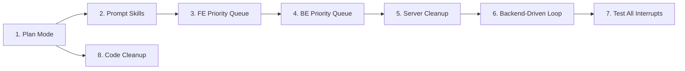

# Wild Loop v4 — Step-by-Step Implementation Plan

> Ref: [Issue #23 — Truly Wild Mode](https://github.com/GindaChen/v0-research-agent-mobile/issues/23)

## Why the Current v3 Loop Is Hard to Get Right

The v3 frontend-driven wild loop (`use-wild-loop.ts`) works, but has fundamental fragility:

| Problem                                | Root Cause                                                                                    |
| -------------------------------------- | --------------------------------------------------------------------------------------------- |
| **Browser-bound**                      | Loop dies on tab close/refresh — no persistence                                               |
| **Stale closures**                     | 15+ `useRef` mirrors for every piece of state, all manually synced                            |
| **Prompt logic spread across FE + BE** | `buildExploringPrompt()` in frontend, `_build_chat_prompt()` in backend — both inject context |

| **No planning phase** | Agent jumps straight into action; no user review of the plan before execution |
| **Prompt hardcoded** | Markdown templates are string literals in TS — impossible for users to customize without code changes |
| **No priority** | Alerts and run events processed in arrival order, not by importance |

## Approach: Incremental Steps

Each step is self-contained, testable, and non-breaking. We never rewrite everything at once.

---

## Step 1 — Add Plan Mode

**Goal**: Add a `plan` chat mode alongside `agent | wild | sweep`. When the user selects Plan mode, their message is wrapped in a planning prompt that instructs the agent to _think and propose a plan_ before taking any action.

### Changes

#### Frontend

- **[MODIFY] [chat-input.tsx](file:///Users/mike/Project/GitHub/v0-research-agent-mobile/components/chat-input.tsx)**
  - Add `'plan'` to the `ChatMode` union type
  - Add a Plan mode option to the mode selector UI (icon: 📋 or 🗺️)

- **[MODIFY] [connected-chat-view.tsx](file:///Users/mike/Project/GitHub/v0-research-agent-mobile/components/connected-chat-view.tsx)**
  - Pass plan mode through to `sendMessage()` so the backend receives `wild_mode=false` but a new `plan_mode=true` flag (or we use the mode string)

#### Backend

- **[MODIFY] [server.py](file:///Users/mike/Project/GitHub/v0-research-agent-mobile/server/server.py)**
  - Add `plan_mode: bool = False` to `ChatRequest`
  - In `_build_chat_prompt()`, when `plan_mode=True`, wrap the user message in a planning prompt:
    ```
    # Plan Mode
    You are a planning assistant. Read the user's request and produce a detailed step-by-step plan.
    Do NOT take action yet. Output your plan in markdown.
    Include: what experiments to run, what metrics to track, and what success looks like.
    ```
  - Planning mode also injects `_build_experiment_context()` so the agent has full awareness

### Verification

- Manual: Select Plan mode in UI, send a message, verify agent responds with a plan (no actions taken)
- Manual: Switch to Agent mode and verify normal behavior is unaffected

---

## Step 2 — Prompt Template Customization

**Goal**: Let users customize the markdown prompt templates used in wild mode and plan mode. Instead of hardcoded strings in TS/Python, prompts are stored as editable markdown "skills" that can be tweaked from the UI.

### Design: Prompt Skill Objects

A **Prompt Skill** is a named markdown template with placeholder variables:

```typescript
interface PromptSkill {
  id: string; // e.g. "wild_exploring"
  name: string; // Human label: "Wild Loop — Exploring"
  template: string; // Markdown with {{goal}}, {{iteration}}, {{context}} vars
  builtIn: boolean; // true = shipped default, false = user-created
  variables: string[]; // ["goal", "iteration", "context"] — declared in template
}
```

### Changes

#### Backend

- **[NEW] Prompt Skills API in [server.py](file:///Users/mike/Project/GitHub/v0-research-agent-mobile/server/server.py)**
  - `GET /prompt-skills` — list all skills (built-in + user-created)
  - `GET /prompt-skills/{id}` — get a single skill
  - `PUT /prompt-skills/{id}` — update a skill's template
  - `POST /prompt-skills` — create a new skill
  - Store in a JSON file (`prompt_skills.json`) alongside `chat_data.json`
  - Ship with built-in defaults for: `wild_exploring`, `wild_monitoring`, `wild_analyzing`, `plan_mode`
  - `_build_chat_prompt()` loads the active skill template and interpolates variables

#### Frontend

- **[NEW] [components/prompt-skill-editor.tsx](file:///Users/mike/Project/GitHub/v0-research-agent-mobile/components/prompt-skill-editor.tsx)**
  - Markdown editor for prompt templates
  - Variable insertion toolbar (click to insert `{{goal}}`, `{{context}}`, etc.)
  - Preview pane showing interpolated result

- **[MODIFY] Settings dialog** — add a "Prompt Skills" tab that lists and edits skills

- **[MODIFY] [hooks/use-wild-loop.ts](file:///Users/mike/Project/GitHub/v0-research-agent-mobile/hooks/use-wild-loop.ts)**
  - Replace hardcoded `buildExploringPrompt()` etc. with calls that fetch the active template from the backend
  - Or: continue to construct prompts on the frontend but load the template string from backend config

### Verification

- Manual: Edit a prompt skill in Settings, start a wild loop, verify customized prompt is used
- Manual: Reset to default, verify original behavior

---

## Step 3 — Priority Queue System (Frontend)

**Goal**: Replace the single-slot `pendingPrompt: string | null` with a proper priority queue so events never get silently dropped.

### Design

```typescript
interface QueuedEvent {
  id: string;
  priority: number; // 0 = highest (critical alert), 10 = lowest (status check)
  prompt: string;
  type: "alert" | "run_event" | "analysis" | "exploring" | "user_interrupt";
  createdAt: number;
}
```

Priority levels:

- **0** — User interrupt / NEEDS_HUMAN
- **1** — Critical alerts
- **2** — Warning alerts
- **3** — Run failure events
- **5** — Run completion events
- **7** — Analysis prompts
- **9** — Exploring prompts / periodic check-ins

### Changes

- **[NEW] [lib/event-queue.ts](file:///Users/mike/Project/GitHub/v0-research-agent-mobile/lib/event-queue.ts)**
  - `EventQueue` class with `enqueue(event)`, `dequeue(): QueuedEvent | null`, `peek()`, `size`, `clear()`
  - Min-heap by priority, FIFO within same priority
  - Dedup by event ID

- **[MODIFY] [hooks/use-wild-loop.ts](file:///Users/mike/Project/GitHub/v0-research-agent-mobile/hooks/use-wild-loop.ts)**
  - Replace `setPendingPrompt(prompt)` → `queue.enqueue({ ... })`
  - Replace `pendingPrompt` state with `nextEvent` derived from `queue.dequeue()`
  - `consumePrompt()` calls `queue.dequeue()` for the next event
  - Remove `isBusyRef` guard — queue handles concurrency naturally
  - Expose `queueSize` in `UseWildLoopResult` for the banner to display

- **[MODIFY] [components/wild-loop-banner.tsx](file:///Users/mike/Project/GitHub/v0-research-agent-mobile/components/wild-loop-banner.tsx)**
  - Show queue depth indicator (e.g., "3 events queued")

### Verification

- Manual: Start a wild loop with multiple concurrent run completions/alerts. Verify all events are processed in priority order, none dropped
- Manual: Verify the queue size indicator in the banner updates correctly

---

## Step 4 — Priority Queue (Backend Integration)

**Goal**: Mirror the priority queue semantics on the backend so that when the loop moves server-side (Step 6), the queue logic is already there.

### Changes

- **[MODIFY] [server.py](file:///Users/mike/Project/GitHub/v0-research-agent-mobile/server/server.py)**
  - Add a `WildEventQueue` class (Python `heapq`-based priority queue)
  - New endpoints:
    - `POST /wild/events/enqueue` — push an event with priority
    - `GET /wild/events/next` — pop the highest-priority event
    - `GET /wild/events/queue` — inspect current queue state (for debugging/UI)
  - Wire alert creation (`POST /alerts`) to auto-enqueue a wild event if `wild_mode_enabled`
  - Wire run status transitions to auto-enqueue events when runs complete/fail
  - `_build_chat_prompt()` optionally pulls enriched context from the event itself

### Verification

- Manual: Create alerts and observe them appearing in the queue via `GET /wild/events/queue`
- Manual: Verify events are dequeued in priority order

---

## Step 5 — Server Codebase Cleanup

**Goal**: Make the current frontend-driven wild loop cleaner by consolidating duplicated prompt logic, extracting wild-loop related code from the monolithic `server.py`, and establishing clear boundaries.

### Changes

- **[NEW] [server/wild_loop.py](file:///Users/mike/Project/GitHub/v0-research-agent-mobile/server/wild_loop.py)**
  - Extract all wild-loop related functions from `server.py`:
    - `_build_experiment_context()`
    - `_build_chat_prompt()` (wild mode portion)
    - Wild event queue
    - Prompt skill loading/interpolation
    - Wild loop state management (`wild_loop_state`, endpoints)
  - Clean up the `server.py` so it only registers the FastAPI routes, delegating logic to `wild_loop.py`

- **[MODIFY] [server.py](file:///Users/mike/Project/GitHub/v0-research-agent-mobile/server/server.py)**
  - Import from `wild_loop.py` instead of having inline logic
  - Keep route registrations but move handler logic to dedicated module

- **[MODIFY] [hooks/use-wild-loop.ts](file:///Users/mike/Project/GitHub/v0-research-agent-mobile/hooks/use-wild-loop.ts)**
  - Clean up: remove unused refs, simplify stage transitions
  - Ensure all prompt construction is delegated (to backend via API, or to imported template utilities)

### Verification

- Manual: Run the server and frontend, verify all existing functionality works unchanged
- Check: `server.py` should be noticeably smaller, with wild loop logic in its own module

---

## Step 6 — Backend-Driven Wild Loop

**Goal**: Move the loop orchestration entirely to the backend. The frontend becomes a passive viewer — it no longer drives iteration, only displays progress and allows pause/stop/resume.

### Design

The backend runs an `asyncio.Task` that:

1. Dequeues events from the `WildEventQueue`
2. Builds prompts using prompt skills
3. Sends them to OpenCode via `send_prompt_to_opencode()`
4. Parses response for `<promise>`, `<sweep>`, `<resolve_alert>` tags
5. Executes side-effects (create sweeps, resolve alerts)
6. Enqueues follow-up events
7. Streams progress to frontend via existing NDJSON channel

### Changes

- **[MODIFY] [server/wild_loop.py](file:///Users/mike/Project/GitHub/v0-research-agent-mobile/server/wild_loop.py)**
  - Add `WildLoopRunner` class with async loop
  - `POST /wild/start` — spawns the runner task
  - `POST /wild/stop` — cancels the task
  - `POST /wild/pause` / `POST /wild/resume`
  - Runner pushes messages into the chat session (like the current `_chat_worker`)
  - Signal parsing (CONTINUE/COMPLETE/NEEDS_HUMAN) moves to Python

- **[MODIFY] [hooks/use-wild-loop.ts](file:///Users/mike/Project/GitHub/v0-research-agent-mobile/hooks/use-wild-loop.ts)**
  - Gut the loop driver logic
  - Keep: `start()` → `POST /wild/start`, `stop()` → `POST /wild/stop`, etc.
  - Keep: polling `GET /wild/status` for phase/iteration/queue stats
  - Remove: prompt builders, signal parsing, `pendingPrompt` mechanism
  - The hook becomes a thin API caller + status poller

- **[MODIFY] [components/connected-chat-view.tsx](file:///Users/mike/Project/GitHub/v0-research-agent-mobile/components/connected-chat-view.tsx)**
  - Remove `autoSend` logic for wild loop
  - Messages from the backend-driven loop arrive via `GET /sessions/{id}/stream` like normal chat responses

### Verification

- Manual: Start wild loop from UI. Close browser tab. Reopen. Verify loop is still running and progress is visible
- Manual: Verify pause/resume from a different browser tab
- Manual: Verify the loop processes events in priority order

---

## Step 7 — Test Interrupts and Edge Cases

**Goal**: Comprehensive testing of all interrupt scenarios.

### Test Matrix

| Scenario                                      | Expected Behavior                                                      |
| --------------------------------------------- | ---------------------------------------------------------------------- |
| User clicks Stop during iteration             | Loop stops gracefully, last response is saved                          |
| User clicks Pause → does manual chat → Resume | Loop pauses, user can chat normally, resume picks up where it left off |
| Browser tab closes                            | Backend loop continues, re-opening shows current state                 |
| Server restart                                | Loop state is persisted and can be resumed                             |
| Agent outputs NEEDS_HUMAN                     | Loop pauses, notification sent, user can intervene                     |
| Alert fires during exploring phase            | Event queued, processed after current turn completes                   |
| Multiple alerts fire simultaneously           | All queued, processed in priority order                                |
| Termination condition reached                 | Loop stops, user notified                                              |
| Network disconnect during streaming           | Backend loop continues, frontend reconnects                            |

### Changes

- **[NEW] [tests/wild_loop_test.py](file:///Users/mike/Project/GitHub/v0-research-agent-mobile/tests/wild_loop_test.py)**
  - Unit tests for `WildEventQueue` (priority ordering, dedup)
  - Unit tests for `WildLoopRunner` state transitions
  - Integration tests for pause/resume/stop lifecycle

- **[MODIFY] Frontend** — manual QA for all scenarios above

### Verification

- Run `python -m pytest tests/wild_loop_test.py -v`
- Manual: Walk through each row of the test matrix

---

## Step 8 — Code Cleanup: Data-Driven Mode Prompt Builder

**Goal**: Refactor `_build_chat_prompt()` to eliminate per-mode `if/elif` branches. Each mode should be a declarative entry mapping a **skill ID** to a **state builder** function — not a bespoke code path.

### Problem

Today `_build_chat_prompt()` has mode-specific logic inline:

```python
if plan_mode:
    # 10 lines: build variables, call render("ra_mode_plan", {...})
elif wild_mode:
    # 40 lines: build iteration, sweep_note, experiment_context, call render("wild_system", {...})
```

Adding a new mode means adding another `elif` with its own variable-construction code. This doesn't scale.

### Design: Mode Registry

```python
# Each mode declares: skill template ID + a function that produces the template variables
MODE_REGISTRY: Dict[str, ModeConfig] = {
    "plan": ModeConfig(
        skill_id="ra_mode_plan",
        build_state=_build_plan_state,   # returns {"goal": ..., "experiment_context": ...}
    ),
    "wild": ModeConfig(
        skill_id="wild_system",
        build_state=_build_wild_state,   # returns {"iteration": ..., "goal": ..., ...}
    ),
}
```

Then `_build_chat_prompt()` becomes:

```python
def _build_chat_prompt(session, message, mode="agent"):
    mode_note = ""
    config = MODE_REGISTRY.get(mode)
    if config:
        variables = config.build_state(message)
        rendered = prompt_skill_manager.render(config.skill_id, variables)
        if rendered:
            mode_note = rendered + "\n\n"
        else:
            logger.warning(f"{config.skill_id} skill not found")
    content = f"{mode_note}[USER] {message}"
    ...
```

### Changes

- **[MODIFY] [server.py](file:///Users/mike/Project/GitHub/v0-research-agent-mobile/server/server.py)**
  - Replace `wild_mode: bool` + `plan_mode: bool` with `mode: str = "agent"` in `ChatRequest`
  - Extract `_build_plan_state(message)` and `_build_wild_state(message)` as standalone functions
  - Create `MODE_REGISTRY` dict
  - Simplify `_build_chat_prompt()` to a generic loop over the registry

- **[MODIFY] Frontend data flow**
  - Send `mode: "plan" | "wild" | "agent"` as a string instead of separate boolean flags

### Verification

- Manual: All three modes (agent, plan, wild) still produce correct prompts
- Adding a hypothetical new mode should only require: 1 skill template + 1 state builder function + 1 registry entry

---

## Implementation Order & Dependencies



Each step can be merged independently. Steps 1–3 are purely additive. Steps 4–5 are refactors. Step 6 is the big architectural shift. Step 7 is validation. Step 8 can happen any time after Step 1.

---

## Estimated Effort

| Step                   | Effort                          | Risk                                  |
| ---------------------- | ------------------------------- | ------------------------------------- |
| 1. Plan Mode           | Small (1–2 files)               | Low                                   |
| 2. Prompt Skills       | Medium (new API + editor UI)    | Medium — template engine design       |
| 3. FE Priority Queue   | Medium (rewrite hook internals) | Medium — must not break existing flow |
| 4. BE Priority Queue   | Small (new endpoints)           | Low                                   |
| 5. Server Cleanup      | Medium (extract module)         | Low — refactor only                   |
| 6. Backend-Driven Loop | Large (new runner, gut FE)      | High — core architecture change       |
| 7. Testing             | Medium                          | Low                                   |
| 8. Code Cleanup        | Small (refactor only)           | Low — pure refactor, no new features  |
